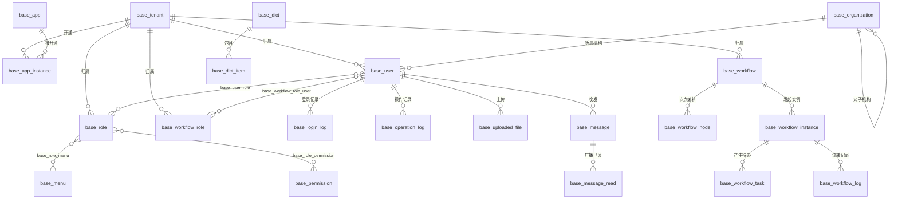

# 底座平台（Base）数据库说明文档

> 适用范围：`base/`（管理后端 + 管理后台）所使用的数据库
> 数据库类型：MySQL ≥ 8.0
> 建表方式：后端启动时通过 GORM `AutoMigrate` 自动建表（见 `backend/pkg/db/db.go` 的 `migrate()`）
> 数据初始化：启动时幂等写入超级管理员、默认菜单与接口权限点（见 `backend/internal/seed/` 与 `service/auth_service.go`）
> 文档与代码同步至：2026-09-24

---

## 一、连接信息

| 配置项 | 值 | 说明 |
| --- | --- | --- |
| 库名 | `caam_base` | 见 `backend/config.yaml` 的 `mysql.dbname` |
| 字符集 | `utf8mb4` | 支持完整中文与 Emoji |
| 时区 | 本地时区（`loc=Local`） | DSN 中 `parseTime=True&loc=Local`，不写 `Asia/Shanghai` 这类固定时区 |
| 连接 | `mysql.host:mysql.port`（本仓库当前 `10.3.1.95:63400`） | `max_open` 100 / `max_idle` 10 |
| 账号/密码 | `mysql.user` / `mysql.password` | **明文写在 `config.yaml`**（Base 无环境变量注入通道），部署时请改值并收紧文件权限 |
| Redis | `redis.addr` / `redis.db`（当前 `127.0.0.1:6379` / db `1`） | 单库存放验证码、登录失败计数、限流计数、Token 吊销黑名单；**PING 失败会直接退出进程** |

> ⚠️ **程序不建库**：请先手工创建数据库（InnoDB + utf8mb4）并授予账号建表与 `ALTER`（加索引）权限。

### 命名与类型约定

- **表名带模块前缀**：所有表均以 `base_` 开头，由各模型显式 `TableName()` 指定（如 `base_user`、`base_menu`），不依赖 GORM 复数化。
- **主键**：所有表主键为 `id`，类型 `bigint unsigned AUTO_INCREMENT`；公共字段为 `created_at` / `updated_at`（`datetime(3)`，由 GORM 自动维护），统一由 `models.BaseModel` 提供。
- **物理删除（硬删）**：模型内嵌的 `BaseModel` **不含** `gorm.DeletedAt`，各表**没有** `deleted_at` 列，删除即 `DELETE`（无回收站/恢复语义）。旧库残留的软删数据由启动期 `pkg/db.purgeLegacySoftDeletedRows()` 自动物理删除；残留的 `deleted_at` 列与 `idx_<表名>_deleted_at` 索引按 `base/DEPLOY.md`「可选手工 SQL」清理。
- **布尔字段**：MySQL 中映射为 `tinyint(1)`（`boolean`）。
- **整数类型**：Go `int` / `int64` → `bigint`；Go `uint64`（ID 类）→ `bigint unsigned`。
- **字符串类型**：`size:n` → `varchar(n)`；`type:text` → `text`。
- **可空时间字段**：`end_at`、`handled_at`、`read_at`、`send_at`、`reminded_at` 使用 `*time.Time`，未发生时写入 `NULL`（避免 MySQL 严格模式 `NO_ZERO_DATE` 拒绝 `0000-00-00`）。
- **关联表命名**：多对多关联表显式声明（`base_role_permission`、`base_workflow_role_user`、`base_message_read`）或由 GORM 依 `many2many:` 生成（`base_user_role`、`base_role_menu`）。
  ⚠️ `RolePermission` 必须显式 `TableName() = base_role_permission`，否则 GORM 复数化会额外建一张无用的 `base_role_permissions` 空表。

---

## 二、表清单总览

| # | 表名 | 模块 | 说明 |
| --- | --- | --- | --- |
| 1 | `base_tenant` | 平台/租户 | 租户（平台级资源） |
| 2 | `base_app` | 应用 | 应用定义（平台级资源） |
| 3 | `base_app_instance` | 应用 | 应用实例（租户开通的应用） |
| 4 | `base_user` | 系统管理 | 用户 |
| 5 | `base_role` | 系统管理 | 系统角色（决定菜单与接口权限） |
| 6 | `base_permission` | 系统管理 | 接口权限点 / 权限分组（平台级资源） |
| 7 | `base_role_permission` | 系统管理 | 角色-权限关联（多对多） |
| 8 | `base_user_role` | 系统管理 | 用户-角色关联（多对多，GORM 生成） |
| 9 | `base_role_menu` | 系统管理 | 角色-菜单关联（多对多，GORM 生成） |
| 10 | `base_menu` | 系统管理 | 菜单（含目录/菜单/按钮，支撑动态路由） |
| 11 | `base_organization` | 组织架构 | 机构（树形） |
| 12 | `base_dict` | 基础配置 | 数据字典分组 |
| 13 | `base_dict_item` | 基础配置 | 数据字典项 |
| 14 | `base_setting` | 基础配置 | 系统设置（按 `category + key` 存键值） |
| 15 | `base_message` | 消息 | 站内消息（定向 / 广播草稿与已发送） |
| 16 | `base_message_read` | 消息 | 广播消息的「每人已读」记录 |
| 17 | `base_message_template` | 消息 | 消息模板（`{{变量}}` 渲染） |
| 18 | `base_uploaded_file` | 文件 | 上传文件元数据 |
| 19 | `base_operation_log` | 审计 | 操作日志 |
| 20 | `base_login_log` | 审计 | 登录日志 |
| 21 | `base_workflow_role` | 工作流 | 流程角色（审批职责，与系统角色解耦） |
| 22 | `base_workflow_role_user` | 工作流 | 流程角色-用户关联（多对多） |
| 23 | `base_workflow` | 工作流 | 流程定义 |
| 24 | `base_workflow_node` | 工作流 | 流程节点（审批环节） |
| 25 | `base_workflow_instance` | 工作流 | 流程实例（一次具体审批） |
| 26 | `base_workflow_task` | 工作流 | 审批任务（待办） |
| 27 | `base_workflow_log` | 工作流 | 流转日志（审批时间线） |

> 27 张表全部由 `pkg/db.migrate()` 的 `AutoMigrate` 创建；其中 `base_user_role`、`base_role_menu` 是 GORM 依 `many2many` 自动生成的连接表（无独立模型文件）。

---

## 三、表结构详细说明

### 3.1 平台与租户

#### `base_tenant` 租户表

| 字段 | 类型 | 允许空 | 默认 | 键 | 说明 |
| --- | --- | --- | --- | --- | --- |
| id | bigint unsigned | 否 | AUTO_INCREMENT | PK | 主键 |
| created_at / updated_at | datetime(3) | 是 | - | - | 时间戳 |
| code | varchar(64) | 是 | - | UNIQUE | 租户编码（登录时填写的「租户编码」） |
| name | varchar(128) | 是 | - | - | 租户名称 |
| status | bigint | 是 | 1 | - | 状态：1 启用 / 0 禁用 |
| contact_name | varchar(64) | 是 | - | - | 联系人 |
| contact_phone | varchar(32) | 是 | - | - | 联系电话 |
| description | varchar(512) | 是 | - | - | 描述 |

> **平台级租户**：`models.PlatformTenantID = 0`，判断统一用 `models.IsPlatformTenant(tenantID)`，禁止内联 `tenantID == 0`。
> 租户路由绑定 `middleware.SuperAdminOnly()`，仅平台超管可访问；删除时校验该租户下是否还有用户 / 角色 / 应用实例 / 流程角色 / 流程定义 / 流程实例。

#### `base_app` 应用定义表（平台级）

| 字段 | 类型 | 允许空 | 默认 | 键 | 说明 |
| --- | --- | --- | --- | --- | --- |
| id | bigint unsigned | 否 | AUTO_INCREMENT | PK | 主键 |
| created_at / updated_at | datetime(3) | 是 | - | - | 时间戳 |
| code | varchar(64) | 是 | - | UNIQUE | 应用编码（子应用接入标识，如 `caam-portal`） |
| name | varchar(128) | 是 | - | - | 应用名称 |
| icon | varchar(256) | 是 | - | - | 图标 |
| type | varchar(32) | 是 | - | - | 接入类型：`iframe` / `proxy`（微应用已下线） |
| frontend_url | varchar(512) | 是 | - | - | 前端入口地址（iframe 用） |
| backend_url | varchar(512) | 是 | - | - | 后端入口地址（proxy 代理目标） |
| api_prefix | varchar(128) | 是 | - | - | API 前缀（代理时拼在业务路径前，留空直接转发） |
| status | bigint | 是 | 1 | - | 状态：1 启用 / 0 禁用 |
| sort | bigint | 是 | 0 | - | 排序 |
| description | varchar(512) | 是 | - | - | 描述 |

> 平台级资源：租户可 `GET /apps` 查看可开通的应用，仅平台超管可增删改（`middleware.SuperAdminOnly()`）。

#### `base_app_instance` 应用实例表

| 字段 | 类型 | 允许空 | 默认 | 键 | 说明 |
| --- | --- | --- | --- | --- | --- |
| id | bigint unsigned | 否 | AUTO_INCREMENT | PK | 主键 |
| created_at / updated_at | datetime(3) | 是 | - | - | 时间戳 |
| tenant_id | bigint unsigned | 是 | - | IDX | 租户 ID |
| app_id | bigint unsigned | 是 | - | IDX | 应用 ID（外键指向 `base_app.id`，GORM 约束 `fk_base_app_instance_app`） |
| status | bigint | 是 | 1 | - | 状态：1 启用 / 0 禁用 |
| config | text | 是 | - | - | 实例配置 JSON |

> 业务规则：同一租户 + 同一应用不可重复开通（应用层校验），删除后可重新开通。
> 代理入口会用 `app_id → base_app` 判断「租户已开通并启用该应用」，平台超管放行。

### 3.2 系统管理（用户 / 角色 / 权限 / 菜单）

#### `base_user` 用户表

| 字段 | 类型 | 允许空 | 默认 | 键 | 说明 |
| --- | --- | --- | --- | --- | --- |
| id | bigint unsigned | 否 | AUTO_INCREMENT | PK | 主键 |
| created_at / updated_at | datetime(3) | 是 | - | - | 时间戳 |
| tenant_id | bigint unsigned | 是 | - | IDX, UK | 租户 ID（0 = 平台超管） |
| username | varchar(64) | 是 | - | UK | 用户名 |
| password | varchar(128) | 是 | - | - | 密码（bcrypt 哈希，JSON 序列化时隐藏） |
| real_name | varchar(64) | 是 | - | - | 真实姓名 |
| phone | varchar(32) | 是 | - | - | 手机号 |
| email | varchar(128) | 是 | - | - | 邮箱 |
| avatar | varchar(512) | 是 | - | - | 头像 |
| status | bigint | 是 | 1 | - | 状态：1 启用 / 0 禁用 |
| is_admin | tinyint(1) | 是 | 0 | - | 是否租户管理员（开启后在本租户内拥有全部接口权限与菜单） |
| organization_id | bigint unsigned | 是 | - | IDX | 所属机构 ID（0 = 未分配） |

- 唯一索引 `uk_base_user_tenant_username (tenant_id, username)`：**同租户内不可重名、跨租户可同名**（与登录按「租户编码 + 用户名」定位一致）。
- 登录失败次数 / 锁定状态**不落库**，存 Redis：`login_fail:<tenantID>:<username>`（TTL = 锁定时长）。
- 删除保护：不能删除当前登录用户；不能删除平台内置 `admin`（`tenant_id = 0`）；删除时级联清理 `base_user_role` 与 `base_workflow_role_user`。
- `organization_id` 引用的机构必须存在且属于该租户（或平台内置机构）；机构下仍有用户时不允许删除机构。

#### `base_role` 角色表

| 字段 | 类型 | 允许空 | 默认 | 键 | 说明 |
| --- | --- | --- | --- | --- | --- |
| id | bigint unsigned | 否 | AUTO_INCREMENT | PK | 主键 |
| created_at / updated_at | datetime(3) | 是 | - | - | 时间戳 |
| tenant_id | bigint unsigned | 是 | - | IDX | 租户 ID（0 = 平台角色） |
| code | varchar(64) | 是 | - | - | 角色编码（租户内唯一，前端表单留空会自动生成） |
| name | varchar(128) | 是 | - | - | 角色名称 |
| status | bigint | 是 | 1 | - | 状态：1 启用 / 0 禁用 |
| remark | varchar(512) | 是 | - | - | 备注 |

- 平台内置角色：`tenant_id=0, code=super_admin`（名称「超级管理员」），**禁止删除**（`RoleService.Delete` 保护），并在启动时自动获得全部底座权限点。
- 角色与菜单、权限的关联走 `base_role_menu` / `base_role_permission`；删除角色时事务内清理这两张关联表与 `base_user_role`。

#### `base_permission` 权限点表（平台级）

| 字段 | 类型 | 允许空 | 默认 | 键 | 说明 |
| --- | --- | --- | --- | --- | --- |
| id | bigint unsigned | 否 | AUTO_INCREMENT | PK | 主键 |
| created_at / updated_at | datetime(3) | 是 | - | - | 时间戳 |
| app_code | varchar(64) | 是 | - | IDX | 所属应用编码（`base` 或子应用编码） |
| code | varchar(128) | 是 | - | - | 权限编码（幂等键，如 `base:user:create`） |
| name | varchar(128) | 是 | - | - | 权限名称 |
| type | varchar(32) | 是 | - | - | 类型：`menu` 分组（仅用于权限树展示）/ `api` 接口（参与匹配）/ `button` 按钮 |
| parent_id | bigint unsigned | 是 | 0 | - | 父权限 ID |
| path | varchar(256) | 是 | - | - | 接口路径（**相对路径**，如 `/users/:id`；`type=api` 才有意义） |
| method | varchar(16) | 是 | - | - | HTTP 方法（`type=api` 才有意义） |
| status | bigint | 是 | 1 | - | 状态：1 启用 / 0 禁用 |

- 匹配口径：`middleware.PermissionAuth` 用「HTTP Method + 路由模板」与 `method` + `path` 比对，支持 `:param` 通配（子应用代理侧 `pkg/permmatch` 额外支持 `*`）。
- 权限点是**全局基线**，仅平台超管可维护；新增接口必须在此登记，否则只有平台超管 / 租户管理员可用。

#### `base_role_permission` 角色-权限关联表

| 字段 | 类型 | 允许空 | 默认 | 键 | 说明 |
| --- | --- | --- | --- | --- | --- |
| role_id | bigint unsigned | 否 | - | PK | 角色 ID |
| permission_id | bigint unsigned | 否 | - | PK | 权限点 ID |

#### `base_user_role` 用户-角色关联表（GORM 生成）

| 字段 | 类型 | 允许空 | 默认 | 键 | 说明 |
| --- | --- | --- | --- | --- | --- |
| user_id | bigint unsigned | 否 | - | PK | 用户 ID |
| role_id | bigint unsigned | 否 | - | PK | 角色 ID |

#### `base_role_menu` 角色-菜单关联表（GORM 生成）

| 字段 | 类型 | 允许空 | 默认 | 键 | 说明 |
| --- | --- | --- | --- | --- | --- |
| role_id | bigint unsigned | 否 | - | PK | 角色 ID |
| menu_id | bigint unsigned | 否 | - | PK | 菜单 ID |

#### `base_menu` 菜单表

| 字段 | 类型 | 允许空 | 默认 | 键 | 说明 |
| --- | --- | --- | --- | --- | --- |
| id | bigint unsigned | 否 | AUTO_INCREMENT | PK | 主键 |
| created_at / updated_at | datetime(3) | 是 | - | - | 时间戳 |
| tenant_id | bigint unsigned | 是 | - | IDX | 租户 ID（0 = 系统默认/平台预置菜单） |
| app_code | varchar(64) | 是 | - | IDX | 所属应用编码（`base` 表示底座） |
| parent_id | bigint unsigned | 是 | 0 | - | 父菜单 ID |
| name | varchar(128) | 是 | - | - | 菜单名称（**同时被用作 keep-alive 的组件名**） |
| icon | varchar(64) | 是 | - | - | Element Plus 图标名 |
| path | varchar(256) | 是 | - | - | 前端路由路径（如 `/system/user`） |
| component | varchar(256) | 是 | - | - | 组件路径（如 `base/user/index.vue`；iframe 菜单填外部地址） |
| type | varchar(32) | 是 | - | - | 类型：`directory` 目录 / `menu` 菜单 / `button` 按钮 |
| permission | varchar(128) | 是 | - | - | 权限标识（保留字段） |
| sort | bigint | 是 | 0 | - | 排序 |
| status | bigint | 是 | 1 | - | 状态：1 启用 / 0 禁用（前端生成路由时跳过 0） |
| hidden | tinyint(1) | 是 | 0 | - | 是否隐藏（隐藏后前端不渲染该菜单） |
| keep_alive | tinyint(1) | 是 | 0 | - | 是否页面缓存（`type=menu` 且非 iframe 时生效，前端注入组件名实现） |
| target | varchar(32) | 是 | - | - | 打开方式：`_self` / `_blank` / `iframe` |

- 读取可见性：`tenant_id = 自身 OR tenant_id = 0`；平台预置菜单（`tenant_id = 0`）对租户**只读**。
- 菜单是**动态路由唯一来源**：前端 `GET /auth/menus` → `generateRoutes()`；没有菜单 = 没有页面。
- 删除保护：存在子菜单时拒绝删除；删除时清理 `base_role_menu`。
- 启动时 `seed.cleanupObsoleteMenus()` 会物理删除 4 个历史占位菜单（组件 `base/workflow/{model,instance,task,designer}/index.vue`）并清理关联。

### 3.3 组织架构

#### `base_organization` 机构表

| 字段 | 类型 | 允许空 | 默认 | 键 | 说明 |
| --- | --- | --- | --- | --- | --- |
| id | bigint unsigned | 否 | AUTO_INCREMENT | PK | 主键 |
| created_at / updated_at | datetime(3) | 是 | - | - | 时间戳 |
| tenant_id | bigint unsigned | 是 | - | IDX | 租户 ID（0 = 平台内置机构） |
| parent_id | bigint unsigned | 是 | 0 | - | 父机构 ID（0 为根，树形结构） |
| code | varchar(64) | 是 | - | - | 机构编码 |
| name | varchar(128) | 是 | - | - | 机构名称 |
| leader | varchar(64) | 是 | - | - | 负责人 |
| phone | varchar(32) | 是 | - | - | 联系电话 |
| email | varchar(128) | 是 | - | - | 邮箱 |
| sort | bigint | 是 | 0 | - | 排序 |
| status | bigint | 是 | 1 | - | 状态：1 启用 / 0 禁用 |
| description | varchar(512) | 是 | - | - | 描述 |

> 读取可见性：`tenant_id = 自身 OR tenant_id = 0`；删除保护：存在子机构或被用户引用时拒绝删除。
> `main.go -mock-data` 会插入 10 条示例机构（`tenant_id = 0`），仅在库中机构为 0 条时执行。

### 3.4 基础配置

#### `base_dict` 字典分组表

| 字段 | 类型 | 允许空 | 默认 | 键 | 说明 |
| --- | --- | --- | --- | --- | --- |
| id | bigint unsigned | 否 | AUTO_INCREMENT | PK | 主键 |
| created_at / updated_at | datetime(3) | 是 | - | - | 时间戳 |
| tenant_id | bigint unsigned | 是 | - | IDX | 租户 ID（0 = 平台预置） |
| code | varchar(64) | 是 | - | - | 字典编码 |
| name | varchar(128) | 是 | - | - | 字典名称 |
| description | varchar(512) | 是 | - | - | 描述 |
| status | bigint | 是 | 1 | - | 状态：1 启用 / 0 禁用 |

#### `base_dict_item` 字典项表

| 字段 | 类型 | 允许空 | 默认 | 键 | 说明 |
| --- | --- | --- | --- | --- | --- |
| id | bigint unsigned | 否 | AUTO_INCREMENT | PK | 主键 |
| created_at / updated_at | datetime(3) | 是 | - | - | 时间戳 |
| dict_id | bigint unsigned | 是 | - | IDX | 所属字典 ID |
| label | varchar(128) | 是 | - | - | 显示名 |
| value | varchar(128) | 是 | - | - | 字典值 |
| sort | bigint | 是 | 0 | - | 排序 |
| status | bigint | 是 | 1 | - | 状态：1 启用 / 0 禁用 |

> 字典项保存为**覆盖式**（`POST /dicts/:id/items` 整体替换），前端弹窗内行内编辑后一次提交。

#### `base_setting` 系统设置表

| 字段 | 类型 | 允许空 | 默认 | 键 | 说明 |
| --- | --- | --- | --- | --- | --- |
| id | bigint unsigned | 否 | AUTO_INCREMENT | PK | 主键 |
| created_at / updated_at | datetime(3) | 是 | - | - | 时间戳 |
| category | varchar(64) | 是 | - | IDX | 分类：`basic` / `security` / `email` / `notify` |
| key | varchar(128) | 是 | - | IDX | 配置键 |
| value | text | 是 | - | - | 配置值（**一律以字符串存储**，布尔为 `"true"/"false"`） |
| default_value | text | 是 | - | - | 默认值（展示用） |
| type | varchar(32) | 是 | - | - | 值类型：string / json / number / boolean |
| remark | varchar(512) | 是 | - | - | 备注 |

> 唯一性由「`category` + `key`」约定（`BatchSave` 先查后写）；表本身无唯一索引。
> 已用到的键：
> - `basic`：`platformName`、`logo`、`copyright`
> - `security`：`captchaEnabled`、`loginLock`、`maxFailCount`、`lockDuration`、`pwdMinLength`
> - `email`：`host`、`port`、`username`、`password`、`from`、`ssl`
> - `notify`：`wechat_webhook_url`、`sms_gateway_url`、`sms_gateway_token`、`sms_sign`
>
> ⚠️ 读取时未配置的项一律回退**代码内置默认值**（`SettingsService.GetSecuritySettings`），因此空表也能正常启动。

### 3.5 消息

#### `base_message` 消息表

| 字段 | 类型 | 允许空 | 默认 | 键 | 说明 |
| --- | --- | --- | --- | --- | --- |
| id | bigint unsigned | 否 | AUTO_INCREMENT | PK | 主键 |
| created_at / updated_at | datetime(3) | 是 | - | - | 时间戳 |
| tenant_id | bigint unsigned | 是 | - | IDX | 租户 ID（0 = 平台级） |
| sender_id | bigint unsigned | 是 | - | IDX | 发送者 ID（0 = 系统） |
| sender_name | varchar(64) | 是 | - | - | 发送者名称快照 |
| receiver_id | bigint unsigned | 是 | - | IDX | 接收者 ID（**0 = 广播**） |
| receiver_type | varchar(32) | 是 | - | - | 接收类型：`user` / `role` / `all` |
| title | varchar(256) | 是 | - | - | 标题 |
| content | text | 是 | - | - | 内容 |
| type | varchar(32) | 是 | - | - | 类型：`notice` / `system` / `private` |
| priority | varchar(16) | 是 | - | - | 优先级：`low` / `normal` / `high` / `urgent` |
| status | bigint | 是 | 3 | - | **发送状态**：2 草稿 / 3 已发送 |
| is_read | tinyint(1) | 是 | 0 | - | 是否已读（**仅对定向消息有效**） |
| read_at | datetime(3) NULL | 是 | NULL | - | 阅读时间 |
| send_at | datetime(3) NULL | 是 | NULL | - | 发送时间 |

- `status` 只表示草稿/已发送，已读用 `is_read`（历史版本用 `status` 同时表达已读，启动时 `normalizeLegacyData()` 会归一为 `is_read=1` + `status=3`）。
- 广播消息（`receiver_id = 0`）在库中**只有一行**，行级 `is_read` 不可信，已读状态记录在 `base_message_read`；广播不支持单个接收者删除（仅发送者或管理员可删）。
- 列表用 `box=inbox|sent` 区分：inbox = 别人发我 / 广播且 `status=3`；sent = `sender_id` 是我（含草稿）。

#### `base_message_read` 广播已读记录表

| 字段 | 类型 | 允许空 | 默认 | 键 | 说明 |
| --- | --- | --- | --- | --- | --- |
| id | bigint unsigned | 否 | AUTO_INCREMENT | PK | 主键 |
| created_at / updated_at | datetime(3) | 是 | - | - | 时间戳 |
| message_id | bigint unsigned | 否 | - | UK | 消息 ID |
| user_id | bigint unsigned | 否 | - | UK | 用户 ID |
| read_at | datetime(3) | 否 | - | - | 读取时间 |

> 唯一索引 `uk_message_read (message_id, user_id)`；标记已读走 upsert，未读数用子查询 `broadcastReadExists` 排除已读者。

#### `base_message_template` 消息模板表

| 字段 | 类型 | 允许空 | 默认 | 键 | 说明 |
| --- | --- | --- | --- | --- | --- |
| id | bigint unsigned | 否 | AUTO_INCREMENT | PK | 主键 |
| created_at / updated_at | datetime(3) | 是 | - | - | 时间戳 |
| tenant_id | bigint unsigned | 是 | - | IDX | 租户 ID（0 = 平台预置模板） |
| code | varchar(64) | 是 | - | - | 模板编码（发送时可传 `templateCode`） |
| name | varchar(128) | 是 | - | - | 模板名称 |
| channel | varchar(32) | 是 | - | - | 渠道：`in-app` / `sms` / `email` / `wechat`（前端表单当前仅开放 `in-app` / `email`） |
| subject | varchar(256) | 是 | - | - | 主题（渲染对象） |
| content | text | 是 | - | - | 内容，支持 `{{变量}}` |
| variables | text | 是 | - | - | 变量说明 JSON（如 `{"name":"用户名"}`） |
| status | bigint | 是 | 1 | - | 状态：1 启用 / 0 禁用 |
| description | varchar(512) | 是 | - | - | 描述 |

> 读取可见性：`tenant_id = 自身 OR tenant_id = 0`；在**同一租户内**按 `code` 取用（`MessageTemplateService.GetByCode`）。

### 3.6 文件

#### `base_uploaded_file` 上传文件表

| 字段 | 类型 | 允许空 | 默认 | 键 | 说明 |
| --- | --- | --- | --- | --- | --- |
| id | bigint unsigned | 否 | AUTO_INCREMENT | PK | 主键 |
| created_at / updated_at | datetime(3) | 是 | - | - | 时间戳（`created_at` 即上传时间） |
| tenant_id | bigint unsigned | 是 | - | IDX | 租户 ID |
| user_id | bigint unsigned | 是 | - | IDX | 上传者 ID |
| file_name | varchar(256) | 是 | - | - | 原始文件名 |
| file_key | varchar(256) | 是 | - | UNIQUE | 存储 key（形如 `20260101/<纳秒>_文件名`） |
| file_type | varchar(64) | 是 | - | - | 扩展名（如 `.png`） |
| file_size | bigint | 是 | - | - | 文件大小（字节） |
| url | varchar(512) | 是 | - | - | 访问地址（`{api_prefix}/files/{file_key}`） |
| storage | varchar(32) | 是 | - | - | 存储方式：`local` |

> 删除文件会同时删除磁盘文件；查询严格按 `tenant_id = 自身`（平台超管可跨租户）。

### 3.7 审计日志

#### `base_operation_log` 操作日志表

| 字段 | 类型 | 允许空 | 默认 | 键 | 说明 |
| --- | --- | --- | --- | --- | --- |
| id | bigint unsigned | 否 | AUTO_INCREMENT | PK | 主键 |
| created_at / updated_at | datetime(3) | 是 | - | - | 时间戳 |
| tenant_id | bigint unsigned | 是 | - | IDX | 租户 ID |
| user_id | bigint unsigned | 是 | - | IDX | 用户 ID |
| username | varchar(64) | 是 | - | - | 用户名快照 |
| module | varchar(64) | 是 | - | - | 模块（gin 路由模板，如 `/business_base/api/users/:id`） |
| action | varchar(64) | 是 | - | - | 操作（`METHOD 原始URL`） |
| method | varchar(16) | 是 | - | - | 请求方法 |
| path | varchar(512) | 是 | - | - | 请求路径 |
| ip | varchar(64) | 是 | - | - | 客户端 IP |
| params | text | 是 | - | - | 请求参数（敏感接口写 `[敏感参数已脱敏]`，超 4KB 截断） |
| result | text | 是 | - | - | 响应结果（超 4KB 截断） |
| status | bigint | 是 | - | - | 状态：1 成功 / 0 失败（HTTP ≥ 400 记为失败） |
| duration | bigint | 是 | - | - | 耗时（毫秒） |
| operation_at | datetime(3) | 是 | - | IDX | 操作时间（用于列表时间范围筛选） |

> 审计日志**只增不改**（除批量删除/按保留天数清理）；导出 CSV 带 UTF-8 BOM。

#### `base_login_log` 登录日志表

| 字段 | 类型 | 允许空 | 默认 | 键 | 说明 |
| --- | --- | --- | --- | --- | --- |
| id | bigint unsigned | 否 | AUTO_INCREMENT | PK | 主键 |
| created_at / updated_at | datetime(3) | 是 | - | - | 时间戳（`created_at` 即登录时间） |
| tenant_id | bigint unsigned | 是 | - | IDX | 租户 ID |
| user_id | bigint unsigned | 是 | - | IDX | 用户 ID（失败且用户不存在时为 0） |
| username | varchar(64) | 是 | - | - | 用户名 |
| ip | varchar(64) | 是 | - | - | 客户端 IP |
| agent | varchar(512) | 是 | - | - | User-Agent |
| status | bigint | 是 | - | - | 状态：1 成功 / 0 失败 |
| message | varchar(256) | 是 | - | - | 说明（失败原因等） |

### 3.8 工作流

#### `base_workflow_role` 流程角色表

| 字段 | 类型 | 允许空 | 默认 | 键 | 说明 |
| --- | --- | --- | --- | --- | --- |
| id | bigint unsigned | 否 | AUTO_INCREMENT | PK | 主键 |
| created_at / updated_at | datetime(3) | 是 | - | - | 时间戳 |
| tenant_id | bigint unsigned | 是 | - | IDX | 租户 ID |
| code | varchar(64) | 是 | - | - | 角色编码（租户内唯一，供流程节点引用） |
| name | varchar(128) | 是 | - | - | 角色名称（如「审核组」） |
| description | varchar(512) | 是 | - | - | 角色说明 |
| status | bigint | 是 | 1 | - | 状态：1 启用 / 0 禁用 |

> 与系统角色（`base_role`）**刻意解耦**：流程角色只描述「谁有资格审批」，不涉及菜单与接口权限。
> 严格按租户隔离（不像菜单/消息那样可见 `tenant_id = 0`）；成员必须与角色同租户。

#### `base_workflow_role_user` 流程角色成员表

| 字段 | 类型 | 允许空 | 默认 | 键 | 说明 |
| --- | --- | --- | --- | --- | --- |
| workflow_role_id | bigint unsigned | 否 | - | PK | 流程角色 ID |
| user_id | bigint unsigned | 否 | - | PK | 用户 ID |

> 显式声明（而非依赖 GORM 自动复数化），否则 `AutoMigrate` 会额外建一张重复表。

#### `base_workflow` 流程定义表

| 字段 | 类型 | 允许空 | 默认 | 键 | 说明 |
| --- | --- | --- | --- | --- | --- |
| id | bigint unsigned | 否 | AUTO_INCREMENT | PK | 主键 |
| created_at / updated_at | datetime(3) | 是 | - | - | 时间戳 |
| tenant_id | bigint unsigned | 是 | - | IDX | 租户 ID |
| code | varchar(64) | 是 | - | - | 流程编码（如 `content-audit`） |
| name | varchar(128) | 是 | - | - | 流程名称 |
| description | varchar(512) | 是 | - | - | 流程说明 |
| status | bigint | 是 | 1 | - | 状态：1 启用 / 0 停用（停用后不能发起新实例，已有实例不受影响） |

#### `base_workflow_node` 流程节点表

| 字段 | 类型 | 允许空 | 默认 | 键 | 说明 |
| --- | --- | --- | --- | --- | --- |
| id | bigint unsigned | 否 | AUTO_INCREMENT | PK | 主键 |
| created_at / updated_at | datetime(3) | 是 | - | - | 时间戳 |
| workflow_id | bigint unsigned | 是 | - | IDX | 流程定义 ID（外键被 `base_workflow_instance` 间接依赖，删流程前需先删实例） |
| name | varchar(128) | 是 | - | - | 节点名称（如「初审」） |
| sort | bigint | 是 | 1 | - | 节点顺序（**串行执行**） |
| approver_type | varchar(32) | 是 | - | - | 审批人类型：`role` 流程角色 / `user` 指定用户 / `initiator` 发起人本人 |
| approver_id | bigint unsigned | 是 | 0 | - | 流程角色 ID 或用户 ID（`initiator` 时为 0） |
| approve_mode | varchar(16) | 是 | `or` | - | 审批方式：`or` 或签（默认）/ `and` 会签 |
| timeout_minutes | bigint | 是 | 0 | - | 超时提醒（分钟），0 = 不提醒（保存时限制 0~10080） |
| description | varchar(512) | 是 | - | - | 节点说明 |

> 节点保存是**覆盖式**（`PUT /workflows/:id/nodes`）：存在「审批中」实例时拒绝保存。
> 保存时归一化：`approve_mode` 非 `and` 一律按 `or` 处理。

#### `base_workflow_instance` 流程实例表

| 字段 | 类型 | 允许空 | 默认 | 键 | 说明 |
| --- | --- | --- | --- | --- | --- |
| id | bigint unsigned | 否 | AUTO_INCREMENT | PK | 主键 |
| created_at / updated_at | datetime(3) | 是 | - | - | 时间戳 |
| tenant_id | bigint unsigned | 是 | - | IDX | 租户 ID |
| workflow_id | bigint unsigned | 是 | - | IDX | 流程定义 ID |
| workflow_name | varchar(128) | 是 | - | - | 流程名称快照 |
| title | varchar(256) | 是 | - | - | 标题 |
| business_type | varchar(64) | 是 | - | - | 业务类型（可选，如 `article`） |
| business_id | varchar(64) | 是 | - | - | 业务单据 ID（可选） |
| content | text | 是 | - | - | 申请说明 |
| initiator_id | bigint unsigned | 是 | - | IDX | 发起人 ID |
| initiator_name | varchar(64) | 是 | - | - | 发起人名称快照 |
| current_sort | bigint | 是 | 0 | - | 当前节点顺序 |
| current_node | varchar(128) | 是 | - | - | 当前节点名称 |
| status | bigint | 是 | 1 | - | 状态：1 审批中 / 2 已通过 / 3 已驳回 / 4 已撤销 |
| start_at | datetime(3) | 是 | - | - | 发起时间 |
| end_at | datetime(3) NULL | 是 | NULL | - | 结束时间 |

#### `base_workflow_task` 审批任务表（待办）

| 字段 | 类型 | 允许空 | 默认 | 键 | 说明 |
| --- | --- | --- | --- | --- | --- |
| id | bigint unsigned | 否 | AUTO_INCREMENT | PK | 主键 |
| created_at / updated_at | datetime(3) | 是 | - | - | 时间戳 |
| tenant_id | bigint unsigned | 是 | - | IDX | 租户 ID |
| instance_id | bigint unsigned | 是 | - | IDX | 流程实例 ID |
| node_id | bigint unsigned | 是 | - | IDX | 节点 ID |
| node_name | varchar(128) | 是 | - | - | 节点名称快照 |
| node_sort | bigint | 是 | - | - | 节点顺序快照 |
| approve_mode | varchar(16) | 是 | `or` | - | **审批方式快照**（`or`/`and`）：定义变更不影响运行中的实例 |
| approver_id | bigint unsigned | 是 | - | IDX | 审批人 ID |
| approver_name | varchar(64) | 是 | - | - | 审批人名称快照 |
| status | bigint | 是 | 1 | - | 状态：1 待处理 / 2 已通过 / 3 已驳回 / 4 已失效 |
| comment | varchar(512) | 是 | - | - | 审批意见 / 转办加签说明 |
| timeout_minutes | bigint | 是 | 0 | - | **超时提醒快照**（0 = 不提醒） |
| reminded_at | datetime(3) NULL | 是 | NULL | - | 最近一次超时提醒时间 |
| remind_count | bigint | 是 | 0 | - | 超时提醒次数（详情页以「催」标签展示） |
| handled_at | datetime(3) NULL | 是 | NULL | - | 处理时间 |

#### `base_workflow_log` 流转日志表

| 字段 | 类型 | 允许空 | 默认 | 键 | 说明 |
| --- | --- | --- | --- | --- | --- |
| id | bigint unsigned | 否 | AUTO_INCREMENT | PK | 主键 |
| created_at / updated_at | datetime(3) | 是 | - | - | 时间戳（`created_at` 即发生时间，详情页时间线用） |
| tenant_id | bigint unsigned | 是 | - | IDX | 租户 ID |
| instance_id | bigint unsigned | 是 | - | IDX | 流程实例 ID |
| node_id | bigint unsigned | 是 | - | - | 节点 ID（0 表示非节点动作，如发起/完成） |
| node_name | varchar(128) | 是 | - | - | 节点名称 |
| operator_id | bigint unsigned | 是 | - | - | 操作人 ID（0 = 系统） |
| operator_name | varchar(64) | 是 | - | - | 操作人名称 |
| action | varchar(32) | 是 | - | - | 动作：`start` / `approve` / `reject` / `cancel` / `auto-pass` / `finish` / `transfer` / `add-approver` / `remind` |
| comment | varchar(512) | 是 | - | - | 意见 / 说明 |

---

## 四、表关系（ER）

关键关系说明：

| 关系 | 承载表 / 字段 | 规则 |
| --- | --- | --- |
| 租户 → 业务数据 | 各表的 `tenant_id` | 用户/角色/文件/应用实例严格按租户隔离；字典/机构/消息模板/菜单/消息可读 `tenant_id = 0` 的平台预置数据 |
| 用户 ↔ 角色 | `base_user_role` | 一个用户可多角色；删除用户/角色时清理关联 |
| 角色 ↔ 菜单 / 权限 | `base_role_menu` / `base_role_permission` | 菜单决定页面可见，权限点决定接口可调用 |
| 用户 → 机构 | `base_user.organization_id` → `base_organization.id` | 机构必须是同租户（或平台内置）；机构下有用户则不可删 |
| 用户 ↔ 流程角色 | `base_workflow_role_user` | 成员必须与流程角色同租户 |
| 流程定义 → 节点 | `base_workflow_node.workflow_id` | 节点按 `sort` 串行；存在审批中实例时禁止改节点 |
| 流程实例 → 任务 / 日志 | `base_workflow_task.instance_id` / `base_workflow_log.instance_id` | 任务与日志随实例推进；删除实例时一并物理删除 |
| 消息 → 广播已读 | `base_message_read` | 仅 `receiver_id = 0` 的广播消息需要，`uk_message_read` 保证「每人一次」 |

---

## 五、常用枚举与状态值

| 域 | 字段 | 取值 |
| --- | --- | --- |
| 通用状态 | `status`（租户/应用/实例/用户/角色/机构/字典/模板/流程角色/流程定义） | `1` 启用 / `0` 禁用（流程定义用「启用/停用」表述） |
| 用户 | `is_admin` | `1` 租户管理员 / `0` 普通用户 |
| 应用 | `type` | `iframe` / `proxy` |
| 菜单 | `type` | `directory` 目录 / `menu` 菜单 / `button` 按钮 |
| 菜单 | `target` | `_self` / `_blank` / `iframe` |
| 权限 | `type` | `menu` 分组（仅树展示）/ `api` 接口（参与匹配）/ `button` 按钮 |
| 消息 | `status` | `2` 草稿 / `3` 已发送 |
| 消息 | `type` | `notice` 通知 / `system` 系统 / `private` 私信 |
| 消息 | `priority` | `low` 低 / `normal` 普通 / `high` 高 / `urgent` 紧急 |
| 消息 | `receiver_type` | `user` 指定用户 / `role` 角色 / `all` 全员广播 |
| 消息 | `is_read` | 已读状态（**仅定向消息**；广播见 `base_message_read`） |
| 日志 | `status` | `1` 成功 / `0` 失败 |
| 流程实例 | `status` | `1` 审批中 / `2` 已通过 / `3` 已驳回 / `4` 已撤销 |
| 审批任务 | `status` | `1` 待处理 / `2` 已通过 / `3` 已驳回 / `4` 已失效 |
| 流程节点 / 任务 | `approve_mode` | `or` 或签（默认）/ `and` 会签 |
| 流程节点 | `approver_type` | `role` 流程角色 / `user` 指定用户 / `initiator` 发起人本人 |
| 流程日志 | `action` | `start` / `approve` / `reject` / `cancel` / `auto-pass` / `finish` / `transfer` / `add-approver` / `remind` |
| 设置 | `category` | `basic` / `security` / `email` / `notify` |
| 设置 | `type` | `string` / `json` / `number` / `boolean` |

---

## 六、初始化数据（种子数据）

启动时由 `main.go` → `service.AuthService.EnsureSuperAdmin` → `seed.Run()` 幂等写入，**不需要手工 SQL**。

### 超级管理员用户（`service/auth_service.go`）

| 字段 | 值 |
| --- | --- |
| tenant_id | `0`（平台级） |
| username | `admin` |
| password | `admin123`（bcrypt 哈希存储）→ **上线后请立即修改** |
| is_admin | `true` |
| 角色 | 平台内置角色 `super_admin` |

> 仅当库中不存在该账号时创建；重复启动不会重置密码。`POST /auth/init` 亦可创建（已存在则报错）。

### 内置角色（`seed.seedSuperAdminRole`）

| tenant_id | code | 名称 | 说明 |
| --- | --- | --- | --- |
| `0` | `super_admin` | 超级管理员 | 禁止删除；启动时自动获得全部 `app_code = base` 的权限点，并把新增菜单授予它 |

### 默认菜单（`seed.baseMenuSeeds`，共 23 条）

| 层级 | 菜单 | 路由 | 组件 |
| --- | --- | --- | --- |
| 顶级 | 控制台 | `/index` | `base/dashboard/index.vue` |
| 目录 | 系统管理 | `/system` | —（13 个子菜单，sort 9~13 为审计日志/登录日志/数据字典/文件管理/系统设置） |
| 目录 | 消息管理 | `/message` | — |
| 目录 | 工作流管理 | `/workflow` | — |
| 系统管理 | 租户管理 / 应用管理 / 应用实例 / 用户管理 / 机构管理 / 角色管理 / 菜单管理 / 权限管理 / 审计日志 / 登录日志 / 数据字典 / 文件管理 / 系统设置 | `/system/tenant`、`/system/app`、`/system/app-instance`、`/system/user`、`/system/organization`、`/system/role`、`/system/menu`、`/system/permission`、`/system/log`、`/system/login-log`、`/system/dict`、`/system/file`、`/system/setting` | `base/<模块>/index.vue` |
| 消息管理 | 消息列表 / 消息模板 | `/message/list`、`/message/template` | `base/message/index.vue`、`base/message-template/index.vue` |
| 工作流管理 | 流程角色 / 流程定义 / 流程实例 / 我的待办 | `/workflow/role`、`/workflow/definition`、`/workflow/instance`、`/workflow/task` | `base/workflow-role/index.vue`、`base/workflow/{definition,instance,task}/index.vue` |

- 补种口径：按 `(app_code, parent_id, name)` 匹配，**已存在不覆盖**（保留管理员改名/调整），只补齐缺失项。
- 个人中心 `/profile` 由前端硬编码追加，不来自菜单表。
- 启动时会清理 4 个历史占位菜单（见 3.2 节说明）。

### 权限点（`seed.basePermissionSeeds`，共 112 条）

- 18 条 `type = menu` 分组节点（用户管理 / 角色管理 / 菜单管理 / 接口权限 / 机构管理 / 数据字典 / 应用管理 / 应用实例 / 消息管理 / 消息模板 / 流程角色 / 流程定义 / 流程实例 / 待办任务 / 操作日志 / 登录日志 / 文件管理 / 系统设置）。
- 94 条 `type = api` 接口权限点，`code` 形如 `base:<模块>:<动作>`，`path` 为**相对路径**（如 `POST /users`、`PUT /users/:id`）。
- 按 `code` upsert：已存在则同步名称/类型/父子/方法/路径；新增项自动补入。
- 启动结束时把全部 `app_code = base` 的权限点授予 `super_admin` 角色。

### 未内置的数据

| 数据 | 说明 |
| --- | --- |
| `base_tenant` | 只有平台租户概念（`tenant_id = 0`），**不预置任何业务租户**，需在「租户管理」中创建 |
| `base_app` / `base_app_instance` | 需自行注册应用并为租户开通 |
| `base_setting` | **空表**，读取时回退代码默认值；在「系统设置」保存后才有记录 |
| `base_organization` | 需自行维护；`-mock-data` 会插入 10 条示例机构（仅本地测试） |
| `base_dict` / `base_message_template` | 需自行维护（模板渠道 `in-app` / `email`） |
| 业务数据（消息、文件、流程…） | 运行时产生 |

---

## 七、注意事项

1. **统一硬删**：所有表都没有 `deleted_at`；删除即物理删除，**不可恢复**。删除后同编码/同名记录可直接重建，且是**一条全新记录（ID 不复用）**，旧版「恢复原记录」语义已取消。
2. **历史软删残留由启动期清理**：`purgeLegacySoftDeletedRows()` 先统计、再最多 3 轮逐表 `DELETE ... WHERE deleted_at IS NOT NULL`；受外键引用（`base_app` ← `base_app_instance`、`base_workflow` ← `base_workflow_node`、`base_workflow_instance` ← `base_workflow_task`）的表下轮重试，失败只告警不阻断启动。**清理顺序不可与「手工删列」颠倒**——直接删列会让软删行「复活」。
3. **`AutoMigrate` 只加不删**：旧库残留的 `deleted_at` 列、`idx_base_user_username` 之类的历史索引不会被自动删除（后者由 `dropLegacyUserUsernameIndex()` 显式清理）；其余按 `base/DEPLOY.md` 手工 DROP。
4. **用户名唯一索引前置要求**：`uk_base_user_tenant_username (tenant_id, username)` 建立前必须保证数据无重复，否则服务**起不来**，因此 `dedupeUserUsernames()` 在建索引前执行（保留 id 最小的一条，其余改名 `<原名>_dup<id>`，并 `LEFT(username,40)` 防超长）。
5. **并发唯一性由索引兜底**：service 层预检查只给友好提示；MySQL 1062 会被 `helper.isDuplicateEntry` 转成「该租户下用户名已存在」，不暴露 SQL 细节。
6. **写操作必须校验命中行**：GORM 命中 0 行不报错，更新前用 `ensureRecordExists`、删除后用 `ensureDeleteAffected`；**不要用 `RowsAffected` 判断更新**（MySQL 返回实际变更行数，原样保存为 0）。
7. **时间字段一律用指针表达「未发生」**：`end_at` / `handled_at` / `read_at` / `send_at` / `reminded_at` 为 `*time.Time`，写 `NULL`，避免严格模式 `NO_ZERO_DATE` 拒绝 `0000-00-00`。
8. **关联表命名**：`base_role_permission` 必须显式声明 `TableName`，否则会多出 `base_role_permissions` 空表；`base_workflow_role_user` 同样显式声明，避免 `AutoMigrate` 建重复表。
9. **广播消息已读按人记录**：`receiver_id = 0` 的行级 `is_read` 不可信，未读数与已读筛选必须走 `base_message_read` 子查询，否则「一个人已读 = 所有人已读」。
10. **权限点必须登记**：新接口若不在 `base_permission` 登记，普通用户即使被分配菜单也无法调用（仅超管/租户管理员放行）；反之，登记后未授权将直接 403。
11. **流程节点改动保护与快照**：`approve_mode` / `timeout_minutes` 会快照到 `base_workflow_task`，因此改流程定义不影响进行中的实例；存在审批中实例时禁止保存节点。
12. **消息 `status` 语义**：`status` 只表示 2 草稿 / 3 已发送，已读看 `is_read`；历史数据由 `normalizeLegacyData()` 在启动时归一。
13. **删除级联范围**：`base_user_role`、`base_workflow_role_user`、`base_role_menu`、`base_role_permission` 由 service 在事务内清理；**外键约束**（如 `fk_base_app_instance_app`）会阻止删除被引用的父行，属预期保护行为。
14. **`base_setting` 无唯一索引**：唯一性靠 `BatchSave` 的「先查后写」，直接写 SQL 时要自行保证 `(category, key)` 不重复，否则 `GetByCategory` 取到哪一条不可控。
15. **Redis 强依赖**：验证码、登录失败锁定、限流计数、Token 吊销都存 Redis（单一 db）；Redis 不可用时服务**直接启动失败**（`redis.Init` PING 失败即 Fatal）。
