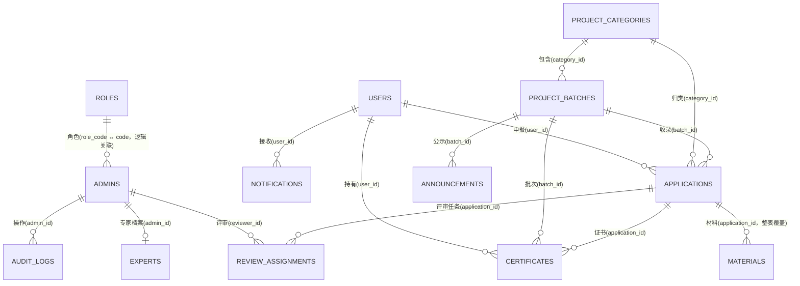

# 项目申报评审系统（Application）数据库说明文档

> 适用范围：`business/application/` 申报评审后端 API（申报人端 + 管理端共用同一套库）
> 数据库类型：MySQL ≥ 8.0
> 建表方式：后端启动时通过 GORM `AutoMigrate` 自动建表（见 `main.go` 第 7 步）
> 数据初始化：启动时自动写入默认角色 / 默认管理账号 / 默认系统配置（幂等，见 `internal/seed/seed.go`）
> 文档与代码同步至：2026-09-23

---

## 一、连接信息

| 配置项 | 值 | 说明 |
| --- | --- | --- |
| 库名 | `caam_application` | 见 `backend/config.yaml` 的 `mysql.db_name` |
| 字符集 | `utf8mb4` | 支持完整中文与 Emoji |
| 时区 | 本机时区（`loc=Local`） | DSN 由 `pkg/db/db.go` 拼接：`...&parseTime=True&loc=Local` |
| 默认端口 | `63400` | 以 `backend/config.yaml` 的 `mysql.port` 为准 |
| 密码 | 环境变量 `APPLICATION_DB_PASSWORD` | 勿提交真实密码；未注入或仍是占位值时程序启动即退出 |
| 连接池 | `max_open: 50` / `max_idle: 10` | 连接最长存活 1 小时（`SetConnMaxLifetime(time.Hour)`） |

### 命名与类型约定

- **表名统一带 `application_` 前缀**：每个模型都实现了 `TableName()`，表名与模型文件名不一一对应（如 `models/application.go` 含两张表），排查时以本文档 / `TableName()` 为准。
- **主键**：所有表主键为 `id`，类型 `bigint unsigned AUTO_INCREMENT`。
- **公共字段**：所有业务表内嵌 `models.BaseModel`，即都有 `id` / `created_at` / `updated_at`；时间字段为 `datetime(3)`（毫秒精度），由 GORM 自动维护。
- **物理删除（硬删）**：`BaseModel` 不包含 `gorm.DeletedAt`，各表**没有** `deleted_at` 列，删除即 `DELETE`（无回收站/恢复语义）。旧库残留的软删数据由启动期 `purgeLegacySoftDeletedRows()`（`pkg/db/db.go`，在 `AutoMigrate` 之前）自动物理清理，只记日志不阻断启动；残留的 `deleted_at` 列与索引按 `business/application/DEPLOY.md`「六、回滚 / 升级」手工 DROP。
- **不建外键约束**：`pkg/db/db.go` 显式设置了 `DisableForeignKeyConstraintWhenMigrating: true`，模型里的 `gorm:"foreignKey:..."` **只用于 GORM 预加载（Preload），数据库层没有 FOREIGN KEY**。因此引用完整性由服务层保证，直接写 SQL 时不会报 1451/1452 类外键错误，但可能造出孤儿数据。
- **不入库的展示字段**：部分模型带 `gorm:"-"` 的瞬时字段（如 `Application.ReviewCount`/`ScoredCount`/`Certificate`、`Expert.ReviewCount`/`ScoredCount`、`ProjectBatch.CanApply`），由服务层查询时填充，**数据库中不存在对应列**，不要据此写 SQL。
- **唯一索引**：`application_users.username`、`application_admins.username`、`application_roles.code`、`application_experts.username`、`application_system_configs.key`。
- **未加唯一索引但服务层保证唯一**：
  - `application_certificates.cert_no`：颁发/编辑时查重，且**已作废的证书不占用编号**（同一年内作废后可重发）。并发双写由事务 +「申报 `published`→`certified` 条件更新」兼作互斥锁保护。
  - `application_review_assignments (application_id, reviewer_id)`：分配评审人在单事务内先对该申报行 `SELECT ... FOR UPDATE` 再读写，避免并发插入重复行（否则同一位专家会被算两次平均分）。
- **可选手工唯一索引**：`uk_app_reviewer (application_id, reviewer_id)` 与 `uk_cert_no_active ((IF(status='void',NULL,cert_no)))`——`AutoMigrate` **不会**建（旧库可能已有重复行），SQL 与去重预检见 `business/application/DEPLOY.md`「手工 SQL（可选加固）」。
- **未加唯一索引但服务层校验唯一**：`application_certificates.cert_no`（`ResultService.IssueCertificate` / `UpdateCertificate` 内比对，且**已作废的证书不占用编号**，以便同一年内作废后重新颁发）。

---

## 二、表清单总览

| # | 表名 | 模块 | 说明 |
| --- | --- | --- | --- |
| 1 | `application_users` | 账号 | 申报人账号（自助注册） |
| 2 | `application_admins` | 账号 | 管理端账号（管理人 / 评审人 / 超级管理员） |
| 3 | `application_roles` | 账号 | 角色与权限码（启动时播种，权限码同时硬编码于 `middleware/auth.go`） |
| 4 | `application_experts` | 专家库 | 专家档案（1:1 关联一个评审人登录账号） |
| 5 | `application_project_categories` | 项目配置 | 项目类别 |
| 6 | `application_project_batches` | 项目配置 | 申报批次（申报通知/申报轮次） |
| 7 | `application_applications` | 项目申报 | 申报记录（业务主表） |
| 8 | `application_materials` | 项目申报 | 申报材料（附件） |
| 9 | `application_review_assignments` | 评审 | 评审任务（专家 × 申报） |
| 10 | `application_announcements` | 结果 | 结果公示公告（自由文本） |
| 11 | `application_certificates` | 结果 | 证书（数据记录 + 附件，不生成 PDF） |
| 12 | `application_notifications` | 通知 | 站内通知（工作流自动产生 + 管理端手工群发） |
| 13 | `application_audit_logs` | 系统 | 管理端操作日志 |
| 14 | `application_system_configs` | 系统 | 系统配置（键值对） |

> 14 张表全部由 `main.go` 的 `AutoMigrate` 创建，无 GORM 自动生成的连接表（本项目不使用多对多关联表）。

---

## 三、表结构详细说明

### 3.1 账号与权限

#### `application_users` 申报人账号表

| 字段 | 类型 | 允许空 | 默认 | 键 | 说明 |
| --- | --- | --- | --- | --- | --- |
| id | bigint unsigned | 否 | AUTO_INCREMENT | PK | 主键 |
| created_at / updated_at | datetime(3) | 是 | - | - | 时间戳 |
| username | varchar(64) | 是 | - | UNIQUE | 登录用户名 |
| password | varchar(128) | 是 | - | - | 密码（bcrypt 哈希，接口不下发） |
| real_name | varchar(64) | 是 | - | - | 真实姓名 |
| phone | varchar(32) | 是 | - | - | 联系电话 |
| email | varchar(128) | 是 | - | - | 电子邮箱 |
| id_card | varchar(32) | 是 | - | - | 身份证号 |
| organization | varchar(256) | 是 | - | - | 所在单位 |
| position | varchar(64) | 是 | - | - | 职务 |
| status | bigint | 是 | 1 | - | 状态：0 禁用 / 1 正常（登录时校验） |

> 申报人由「申报人注册」页自助创建，或由管理端「申报人管理」新增；两处均要求 `username` / `password` / `real_name` 非空，且用户名全局唯一。

#### `application_admins` 管理端账号表

| 字段 | 类型 | 允许空 | 默认 | 键 | 说明 |
| --- | --- | --- | --- | --- | --- |
| id | bigint unsigned | 否 | AUTO_INCREMENT | PK | 主键 |
| created_at / updated_at | datetime(3) | 是 | - | - | 时间戳 |
| username | varchar(64) | 是 | - | UNIQUE | 登录用户名 |
| password | varchar(128) | 是 | - | - | 密码（bcrypt 哈希，接口不下发） |
| real_name | varchar(64) | 是 | - | - | 姓名 |
| phone | varchar(32) | 是 | - | - | 电话 |
| email | varchar(128) | 是 | - | - | 邮箱 |
| role_code | varchar(32) | 是 | - | - | 角色编码：`super_admin` / `manager` / `reviewer` |
| status | bigint | 是 | 1 | - | 状态：0 禁用 / 1 正常 |

> **两套账号互不通用**：申报人存本表的兄弟表 `application_users`，管理端账号存本表。`admin` 账号在申报人登录页必然报「用户名或密码错误」。
> `role_code = reviewer` 的账号**只能从「专家库」新增**（`UserService.CreateAdmin` 会拒绝），以保证账号与专家档案一一对应。

#### `application_roles` 角色表

| 字段 | 类型 | 允许空 | 默认 | 键 | 说明 |
| --- | --- | --- | --- | --- | --- |
| id | bigint unsigned | 否 | AUTO_INCREMENT | PK | 主键 |
| created_at / updated_at | datetime(3) | 是 | - | - | 时间戳 |
| code | varchar(32) | 是 | - | UNIQUE | 角色编码 |
| name | varchar(64) | 是 | - | - | 角色名称 |
| permissions | text | 是 | - | - | 权限码 JSON 数组（界面暂未开放编辑） |
| description | varchar(256) | 是 | - | - | 角色描述 |

> 本表是**展示/留档**用途：接口鉴权实际使用 `middleware/auth.go` 的 `GetRolePermissions()`（硬编码权限码表），`UserService.ListRoles()` 只为「账号管理」的角色下拉提供选项。启动时 `seedRoles()` 会把两处口径对齐（已存在则覆盖 `permissions`）。
> 内置角色见 §六；`code` 必须落在上述三个值内，否则该账号登录后没有任何权限（`validRole` 拦截）。

#### `application_experts` 专家库表

| 字段 | 类型 | 允许空 | 默认 | 键 | 说明 |
| --- | --- | --- | --- | --- | --- |
| id | bigint unsigned | 否 | AUTO_INCREMENT | PK | 主键 |
| created_at / updated_at | datetime(3) | 是 | - | - | 时间戳 |
| admin_id | bigint unsigned | 是 | - | IDX | 关联的评审人登录账号 ID（`application_admins.id`） |
| name | varchar(64) | 是 | - | - | 专家姓名 |
| username | varchar(64) | 是 | - | UNIQUE | 登录账号（与 `application_admins.username` 同值） |
| specialty | varchar(256) | 是 | - | - | 专业领域 |
| title | varchar(64) | 是 | - | - | 职称 |
| organization | varchar(256) | 是 | - | - | 所在单位 |
| phone | varchar(32) | 是 | - | - | 电话 |
| email | varchar(128) | 是 | - | - | 邮箱 |
| bio | text | 是 | - | - | 专家简介 |
| status | bigint | 是 | 1 | - | 状态：0 停用 / 1 启用（与登录账号状态同步） |

> **新增专家 = 同时建两条记录**：`ExpertService.Create` 在一个事务内先建 `application_admins`（`role_code = reviewer`）再建本表；删除同理成对删除。
> `Delete` 前会校验该专家是否已有评审任务（`application_review_assignments.reviewer_id`），有则拒绝删除。

### 3.2 项目配置

#### `application_project_categories` 项目类别表

| 字段 | 类型 | 允许空 | 默认 | 键 | 说明 |
| --- | --- | --- | --- | --- | --- |
| id | bigint unsigned | 否 | AUTO_INCREMENT | PK | 主键 |
| created_at / updated_at | datetime(3) | 是 | - | - | 时间戳 |
| name | varchar(128) | 是 | - | - | 类别名称（必填，服务层 `TrimSpace` 后校验） |
| description | varchar(512) | 是 | - | - | 说明 |
| sort | bigint | 是 | 0 | - | 排序号（列表按 `sort ASC, id ASC`） |

> 删除拦截：该类别下存在申报批次时拒绝（「该类别下存在申报批次，无法删除」）。

#### `application_project_batches` 申报批次表

| 字段 | 类型 | 允许空 | 默认 | 键 | 说明 |
| --- | --- | --- | --- | --- | --- |
| id | bigint unsigned | 否 | AUTO_INCREMENT | PK | 主键 |
| created_at / updated_at | datetime(3) | 是 | - | - | 时间戳 |
| title | varchar(256) | 是 | - | - | 批次名称 |
| category_id | bigint unsigned | 是 | - | IDX | 项目类别 ID（本批次唯一类别） |
| description | text | 是 | - | - | 批次说明 |
| requirements | text | 是 | - | - | 申报要求 |
| apply_start | datetime(3) | 是 | - | - | 申报开始时间 |
| apply_end | datetime(3) | 是 | - | - | 申报截止时间 |
| review_deadline | datetime(3) | 是 | - | - | 评审截止时间（为空表示不限制） |
| status | varchar(32) | 是 | `draft` | - | 批次状态，见 §五 |

> **发布后冻结**：`status != draft` 时禁止修改 `category_id` / `apply_start` / `apply_end`（否则已提交的申报会与批次口径不一致）。
> **自动转评审**：后台任务每 10 分钟执行一次 `AutoCloseExpired()`，把 `status = open` 且 `apply_end < now` 的批次改为 `reviewing`。
> **删除拦截**：批次下存在申报记录或结果公示时拒绝删除。

### 3.3 项目申报

#### `application_applications` 申报记录表（业务主表）

| 字段 | 类型 | 允许空 | 默认 | 键 | 说明 |
| --- | --- | --- | --- | --- | --- |
| id | bigint unsigned | 否 | AUTO_INCREMENT | PK | 主键 |
| created_at / updated_at | datetime(3) | 是 | - | - | 时间戳 |
| batch_id | bigint unsigned | 是 | - | IDX | 申报批次 ID |
| user_id | bigint unsigned | 是 | - | IDX | 申报人 ID（`application_users.id`） |
| category_id | bigint unsigned | 是 | - | IDX | 项目类别 ID（必须与批次类别一致） |
| title | varchar(256) | 是 | - | - | 项目名称（服务层限制 ≤ 100 字符） |
| project_brief | text | 是 | - | - | 项目简介 |
| content | text | 是 | - | - | 申报内容 |
| status | varchar(32) | 是 | `draft` | - | 申报状态，见 §五 |
| total_score | decimal(6,2) | 是 | 0 | - | 已评分之和（服务层汇总） |
| avg_score | decimal(6,2) | 是 | 0 | - | 平均分（= total_score / 已评分人数，无人评分时保持 0） |
| preliminary_opinion | text | 是 | - | - | 初审意见 |
| final_opinion | text | 是 | - | - | 评审结果意见 |
| submitted_at | datetime(3) | 是 | - | - | 提交时间（撤回时置空） |
| published_at | datetime(3) | 是 | - | - | 结果公示时间（撤回公示时置空） |

> **`avg_score` 为 0 有两种含义**（无人评分 / 真实平均 0 分），因此前端一律用服务层填充的 `scoredCount` 判断是否展示分数，不能只看 `avg_score`。
> **可编辑状态**只有 `draft` 与 `preliminary_rejected`（`editable()`）；其余状态接口拒绝改内容、传材料、删除、提交。
> 删除申报时会连带删除其材料行与磁盘文件。

#### `application_materials` 申报材料表

| 字段 | 类型 | 允许空 | 默认 | 键 | 说明 |
| --- | --- | --- | --- | --- | --- |
| id | bigint unsigned | 否 | AUTO_INCREMENT | PK | 主键 |
| created_at / updated_at | datetime(3) | 是 | - | - | 时间戳 |
| application_id | bigint unsigned | 是 | - | IDX | 所属申报 ID |
| name | varchar(256) | 是 | - | - | 材料名称（原文件名） |
| file_url | varchar(512) | 是 | - | - | 文件地址（含 `server.upload_dir_prefix` 的绝对路径，如 `/business_application/uploads/20260923/xxx.pdf`） |
| file_type | varchar(64) | 是 | - | - | 扩展名（不含点，如 `pdf`） |
| file_size | bigint | 是 | - | - | 文件字节数 |

> **整表覆盖式保存**：`SaveMaterials` 先删该申报的全部材料行再插入请求体中的完整列表（事务内），请求体之外的文件会被物理删除。
> 上传约束见 `controllers/upload_controller.go`：单文件 ≤ 50MB，扩展名白名单 `.pdf .doc .docx .xls .xlsx .ppt .pptx .txt .zip .rar .jpg .jpeg .png .gif`；落盘路径 `uploads/YYYYMMDD/<uuid><ext>`（文件名用 UUID，避免同名覆盖）。

### 3.4 专家评审

#### `application_review_assignments` 评审任务表

| 字段 | 类型 | 允许空 | 默认 | 键 | 说明 |
| --- | --- | --- | --- | --- | --- |
| id | bigint unsigned | 否 | AUTO_INCREMENT | PK | 主键 |
| created_at / updated_at | datetime(3) | 是 | - | - | 时间戳 |
| application_id | bigint unsigned | 是 | - | IDX | 申报 ID |
| reviewer_id | bigint unsigned | 是 | - | IDX | 评审人 ID（`application_admins.id`） |
| status | varchar(32) | 是 | `pending` | - | `pending` 待评审 / `scored` 已评分 |
| score | decimal(6,2) | 是 | 0 | - | 评分（0–100，服务层校验） |
| comment | text | 是 | - | - | 评审意见 |
| reviewed_at | datetime(3) | 是 | - | - | 评分时间 |

> **分配规则**：只能分配 `role_code = reviewer` 且 `status = 1` 的账号；已有评分的评审人**不可移除**；批次评审截止后**不可新增**评审人（但可移除未评分者）。
> **评分规则**：一条任务只能评一次（`scored` 后不可重复提交）；批次评审截止后不可再评分。
> **汇总联动**：每次分配/评分后 `recalculateScore()` 重算 `total_score`、`avg_score`，并在「无待评分且有已评分」时把申报从 `under_review` 推进为 `reviewed`；反之（新增待评评审人）会退回 `under_review`。

### 3.5 结果与证书

#### `application_announcements` 结果公示公告表

| 字段 | 类型 | 允许空 | 默认 | 键 | 说明 |
| --- | --- | --- | --- | --- | --- |
| id | bigint unsigned | 否 | AUTO_INCREMENT | PK | 主键 |
| created_at / updated_at | datetime(3) | 是 | - | - | 时间戳 |
| batch_id | bigint unsigned | 是 | - | IDX | 所属批次 ID（0 表示不限定） |
| title | varchar(256) | 是 | - | - | 公示标题（必填） |
| content | text | 是 | - | - | 公示正文（可一键引用该批次已公示结果生成） |
| status | varchar(32) | 是 | `draft` | - | `draft` 草稿 / `published` 已发布 |
| published_at | datetime(3) | 是 | - | - | 发布时间 |

> 已发布的公示**不可编辑、不可删除**（一次性发布，发布后不可撤回）。
> 「引用该批次已公示的评审结果」由 `ResultService.BuildAnnouncementContent` 生成正文：`本批次共受理并公示 N 个项目，其中通过 M 个：` + 逐条 `序号. 项目名称（申报人：xxx）——通过/未通过`。

#### `application_certificates` 证书表

| 字段 | 类型 | 允许空 | 默认 | 键 | 说明 |
| --- | --- | --- | --- | --- | --- |
| id | bigint unsigned | 否 | AUTO_INCREMENT | PK | 主键 |
| created_at / updated_at | datetime(3) | 是 | - | - | 时间戳 |
| application_id | bigint unsigned | 是 | - | IDX | 关联申报 ID |
| user_id | bigint unsigned | 是 | - | IDX | 持有人（申报人）ID，由服务层从申报带入 |
| batch_id | bigint unsigned | 是 | - | IDX | 批次 ID，由服务层从申报带入 |
| cert_no | varchar(64) | 是 | - | - | 证书编号（留空自动生成 `CAAM-<年份>-<申报ID，6 位补零>`） |
| title | varchar(256) | 是 | - | - | 证书名称（必填） |
| holder | varchar(128) | 是 | - | - | 持有人姓名（留空自动取申报人姓名） |
| file_url | varchar(512) | 是 | - | - | 证书文件地址（附件，可下载） |
| status | varchar(32) | 是 | `draft` | - | `draft` 未颁发 / `issued` 已颁发 / `void` 已作废 |
| issued_at | datetime(3) | 是 | - | - | 颁发时间 |
| voided_at | datetime(3) | 是 | - | - | 作废时间 |
| void_reason | varchar(256) | 是 | - | - | 作废原因 |

> 只有 `status = published`（已公示且通过）的申报可颁发证书；颁发后申报状态推进为 `certified`。
> 同一申报同时最多只有一张非作废证书；作废后申报退回 `published`，可重新颁发（并释放原证书编号）。
> 作废记录**保留不删**，作为审计留痕。

### 3.6 站内通知

#### `application_notifications` 站内通知表

| 字段 | 类型 | 允许空 | 默认 | 键 | 说明 |
| --- | --- | --- | --- | --- | --- |
| id | bigint unsigned | 否 | AUTO_INCREMENT | PK | 主键 |
| created_at / updated_at | datetime(3) | 是 | - | - | 时间戳 |
| user_id | bigint unsigned | 是 | - | IDX | 接收人（申报人）ID |
| title | varchar(256) | 是 | - | - | 通知标题 |
| content | text | 是 | - | - | 通知内容 |
| type | varchar(32) | 是 | - | - | 通知类型，见 §五 |
| read_at | datetime(3) | 是 | - | - | 已读时间（为空表示未读） |

> **群发 = 一行一个申报人**（`user_id = 0` 不会入库）：`NotificationService.Send` 在一条 `INSERT` 中为所有申报人各写一行，避免群发只送达一部分。
> 未读数 = `user_id = ? AND read_at IS NULL`；「全部已读」返回受影响行数并在前端提示条数。

### 3.7 系统

#### `application_audit_logs` 管理端操作日志表

| 字段 | 类型 | 允许空 | 默认 | 键 | 说明 |
| --- | --- | --- | --- | --- | --- |
| id | bigint unsigned | 否 | AUTO_INCREMENT | PK | 主键 |
| created_at / updated_at | datetime(3) | 是 | - | - | 时间戳 |
| admin_id | bigint unsigned | 是 | - | IDX | 操作人 ID |
| admin | varchar(64) | 是 | - | - | 操作人账号/姓名 |
| module | varchar(64) | 是 | - | - | 模块（如「批次管理」「证书管理」） |
| action | varchar(128) | 是 | - | - | 操作描述 |
| ip | varchar(64) | 是 | - | - | 客户端 IP |
| detail | text | 是 | - | - | 详情（JSON 等） |

> 由 `AuditService.Record` 在管理端写操作中调用；「系统日志」页按 `module` 与关键字（`action`/`admin`/`detail` 模糊匹配）筛选。

#### `application_system_configs` 系统配置表

| 字段 | 类型 | 允许空 | 默认 | 键 | 说明 |
| --- | --- | --- | --- | --- | --- |
| id | bigint unsigned | 否 | AUTO_INCREMENT | PK | 主键 |
| created_at / updated_at | datetime(3) | 是 | - | - | 时间戳 |
| key | varchar(128) | 是 | - | UNIQUE | 配置键（SQL 中需加反引号：`` `key` ``，为 MySQL 保留字） |
| value | text | 是 | - | - | 配置值 |

> 由 `seed.SystemConfig`（表名 `application_system_configs`）定义并在启动时播种，当前含 `site_name` / `copyright` / `icp_no` / `beian_no`；管理端暂未提供编辑入口。

---

## 四、表关系（ER）



**关键关系说明**

- 申报人 / 管理端账号各自独立：`application_users` ↔ `application_admins` **没有**关联字段，两套登录互不通用。
- 申报记录是业务中枢：向上挂在 `application_project_batches` + `application_project_categories` + `application_users`，向下派生材料、评审任务、证书。
- 评审人即 `application_admins`（`role_code = reviewer`），专家档案 `application_experts.admin_id` 与之 1:1。
- 类别与批次：批次锁定唯一类别（`project_batches.category_id`），申报的 `category_id` 必须与之相同。
- 结果公示有两套并行的呈现：**自由文本** `application_announcements`（按批次）+ **逐条结果**（直接取自 `application_applications` 中 `published_at IS NOT NULL` 的行，无独立表）。申报人端的逐条公示接口（`GET /member/results`）**只返回白名单字段**（项目名称 / 状态 / 批次标题 / 申报人姓名 / 公示时间），不关联整行 `application_users`，避免把全体申报人的身份证号、手机号、邮箱下发。
- 所有引用均为逻辑引用（无数据库外键），删除父级时由服务层判定是否允许（见各表「删除拦截」）。

---

## 五、常用枚举与状态值

| 表.字段 | 值 | 含义 |
| --- | --- | --- |
| `application_users.status` / `application_admins.status` / `application_experts.status` | 0 / 1 | 禁用（或停用） / 启用（正常） |
| `application_admins.role_code` / `application_roles.code` | `super_admin` / `manager` / `reviewer` | 超级管理员 / 管理人 / 评审人 |
| `application_project_batches.status` | `draft` / `open` / `reviewing` / `closed` | 草稿 / 申报中 / 评审中 / 已结束 |
| `application_applications.status` | `draft` / `submitted` / `preliminary_rejected` / `under_review` / `reviewed` / `passed` / `rejected` / `published` / `certified` | 草稿 / 待初审 / 初审驳回 / 待评审 / 评审完成 / 已通过 / 未通过 / 已公示 / 已发证 |
| `application_review_assignments.status` | `pending` / `scored` | 待评审 / 已评分 |
| `application_announcements.status` | `draft` / `published` | 草稿 / 已发布 |
| `application_certificates.status` | `draft` / `issued` / `void` | 未颁发 / 已颁发 / 已作废 |
| `application_notifications.type` | `application` / `review` / `result` / `certificate` / `system` | 申报相关 / 评审相关 / 结果相关 / 证书相关 / 系统通知（工作流自动消息用前四类，管理端手工发送用 `system`） |

**申报状态流转（`ApplicationService`）**

```text
draft(草稿) ──提交──► submitted(待初审)
   ▲                    │
   │ 撤回               ├─初审通过─► under_review(待评审) ──全部评分完成──► reviewed(评审完成)
   └────────────────────┤                    ▲退款（新增待评评审人）              │
        （仅 submitted 可撤回）  ├─初审驳回─► preliminary_rejected(初审驳回)      │
                                     │（改完在申报期内可重新提交）              │
                                     │                            确定结果 ────┤
                                     │                                          ▼
                                     └── 无待评评审人时可直接确定 ──► passed(已通过) / rejected(未通过)
                                                                              │ 公示
                                                                              ▼
                                                              published(已公示，仅通过者改状态) ──颁发证书──► certified(已发证)
                                                                                        ▲                    │
                                                                                        └──── 证书作废 ───────┘
```

**关键约束（写 SQL 或排障时按此判定，避免绕过服务层造成脏数据）**

| 规则 | 说明 |
| --- | --- |
| 可编辑状态 | 仅 `draft` / `preliminary_rejected` 可改内容、传/删材料、删除、提交 |
| 撤回 | 仅 `submitted` 可撤回，撤回后回 `draft` 并清空 `submitted_at` |
| 提交前置 | 批次可申报（`status = open` 且当前时间落在申报窗口内）**且**至少有一条材料 |
| 类别一致 | 申报的 `category_id` 必须等于批次的 `category_id` |
| 初审 | 仅 `submitted` 可初审；通过 → `under_review`，驳回 → `preliminary_rejected`，均写 `preliminary_opinion` |
| 分配评审 | 仅 `under_review` / `reviewed` 可分配；已评分评审人不可移除；批次评审截止后不可新增 |
| 确定结果 | 仅 `reviewed`，或 `under_review` 且无 `pending` 任务时可确定；有 `pending` 时报「还有 N 位评审人未评分，无法确定结果」 |
| 公示 | 仅 `passed` / `rejected` 可公示；通过者改状态为 `published`，未通过者仅写 `published_at`（保留 `rejected` 口径） |
| 撤回结果 | 已公示 → 撤回公示（`published` 退回 `passed` 并清空 `published_at`）；未公示 → 退回 `reviewed` 并清空 `final_opinion`；`certified` 拒绝，需先作废证书 |
| 颁发证书 | 仅 `published` 可颁发；颁发后申报 → `certified`；同一申报只能有一张非作废证书 |
| 作废证书 | 证书 → `void` 并写 `voided_at`/`void_reason`；申报 `certified` → `published`（同一事务） |

> **并发保护（2026-09-23）**：上表所有状态推进都是「先读后写」，现已全部改为 `WHERE ... AND status = ?`
> 的条件更新：`RowsAffected = 0` 时返回「…状态已变更，请刷新后重试」，因此双人同时操作 / 重复点击
> 不会产生重复状态变更、重复通知或重复记录（证书颁发、评审分配与作废证书还额外包在事务里）。
> 评审人看到的申报会抹掉 `total_score` / `avg_score` / `final_opinion` / `preliminary_opinion`（避免打分前被均分锚定），
> `reviewer` 角色也只有 `dashboard:view` + `review:score`，不再拥有 `application:view` / `batch:view`。

---

## 六、初始化数据（种子数据）

后端启动时由 `internal/seed/seed.go` 自动执行，均为**幂等**操作（已存在则跳过）。

### 默认角色（`seedRoles()`）

| 编码 | 名称 | 说明 |
| --- | --- | --- |
| `super_admin` | 超级管理员 | 拥有全部权限（含账号管理） |
| `manager` | 管理人 | 批次、类别、初审、评审分配、结果公示、证书、通知、申报人与专家库管理 |
| `reviewer` | 评审人 | 仅 管理看板 / 我的评审 / 个人资料（权限码只有 `dashboard:view` + `review:score`；看不到其他申报与其他评审人的分数/意见） |

> 角色的 `permissions` 每次启动都会被 `seedRoles()` 覆盖为 `middleware/auth.go` 中同名角色的权限码列表；界面上不提供权限编辑（**角色表不是权限真源**）。

### 默认管理账号（`seedAdmins()`，初始密码 `1qaz@WSX`，bcrypt 存储）

| 用户名 | 姓名 | 角色 |
| --- | --- | --- |
| `admin` | 超级管理员 | `super_admin` |
| `manager` | 项目管理员 | `manager` |
| `reviewer` | 评审专家 | `reviewer` |

> 仅在账号不存在时创建，**不会**覆盖已改过的密码。
> 申报人账号**不播种**，需自助注册或由管理端新增。

### 默认系统配置（`seedSystemConfigs()`）

| key | 默认值 |
| --- | --- |
| `site_name` | `项目申报评审系统` |
| `copyright` | `© 2026 项目申报评审系统` |
| `icp_no` | 空 |
| `beian_no` | 空 |

---

## 七、注意事项

1. **业务数据一律走服务层**：状态机、评分汇总、材料同步、证书编号唯一性等都在 `internal/service/` 内实现（`pickUpdates` 只允许白名单列）。直接 `UPDATE` 数据库极易造出「状态与数据不一致」的记录（例如 `total_score` 与实际评分不符、`published` 但没有发布记录）。
2. **无数据库外键**：删除父记录不会级联，也不会被数据库拦住。删除类操作请走接口（服务层会校验引用并给出可读提示）。
3. **物理删除（硬删）**：各表均无 `deleted_at`，删除即物理删除且不可恢复；旧库残留软删数据由启动期 `purgeLegacySoftDeletedRows()` 清理，残留的 `deleted_at` 列/索引按 `DEPLOY.md`「六、回滚 / 升级」手工 DROP。
4. **两套账号体系**：`application_users`（申报人）与 `application_admins`（管理端）互不通用，排查「登录失败」先确认登录入口与表。
5. **密码安全**：两张账号表的 `password` 均为 bcrypt 哈希，禁止明文；接口永远不下发该字段（`json:"-"`）。
6. **材料接口是覆盖式写入**：`PUT /member/applications/:id/materials` 必须提交**完整列表**，漏传的材料会被删除且磁盘文件同步删除。
7. **证书编号服务层唯一**：`cert_no` 没有唯一索引（因为已作废证书会释放编号）；并发颁发时理论上存在极小概率的编号重复，业务上依赖单点操作。
8. **`avg_score` 需配合 `scoredCount` 解读**：数据库里 0 分与「无人评分」不可区分，展示侧以评审任务表为准。
9. **`application_system_configs.key` 是保留字**：写 SQL 时必须写成 `` `key` ``。
10. **数据库连接**：连接参数见 `backend/config.yaml`；生产环境密码通过环境变量 `APPLICATION_DB_PASSWORD` 注入（未注入或仍是占位值时启动即退出）。

---

## 相关文档

| 文档 | 位置 | 内容 |
| --- | --- | --- |
| 部署说明 | `business/application/DEPLOY.md` | 环境依赖、后端/前端部署、Nginx、回滚与升级、业务速览、FAQ |
| 用户使用手册 | `business/application/frontend/docs/用户使用手册.md` | 申报人端与管理端的界面操作与业务口径（章节与菜单目录一致） |
