# 会员系统（Member）数据库说明文档

> 适用范围：`business/member/` 会员前台 + 会员中心 + 管理后台所使用的数据库
> 数据库类型：MySQL ≥ 8.0（InnoDB + `utf8mb4`）
> 建表方式：后端启动时通过 GORM `AutoMigrate` 自动建表（见 `main.go`，共 18 个模型）
> 数据初始化：启动时自动写入默认管理员 / 机构 / 文章分类 / 系统配置 / 示例公告 / 会员等级（幂等，各表非空即跳过）

---

## 一、连接信息

| 配置项 | 值 | 说明 |
| --- | --- | --- |
| 库名 | `caam_member` | 见 `backend/config.yaml` 的 `mysql.db_name` |
| 字符集 | `utf8mb4` | 支持完整中文与 Emoji |
| 时区 | 宿主机本地时区（DSN `loc=Local`） | `parseTime=True&loc=Local` |
| 地址 / 端口 | `10.3.1.95:63400` | 当前仓库配置值，生产按实际调整 |
| 账号 | `root` | 当前配置值；**生产建议改用最小权限专用账号** |
| 密码 | 环境变量 `MEMBER_DB_PASSWORD` | 勿提交真实密码 |
| 连接池 | `max_open: 50` / `max_idle: 10` | 见 `mysql.max_open`、`mysql.max_idle` |
| Redis | `127.0.0.1:6379`，验证码库 `4`、限流计数库 `5` | Redis 不可达时**启动直接失败**（Ping 失败即 Fatal） |

> 程序**只连库、不建库**：部署前必须先创建 `caam_member` 库（`CREATE DATABASE caam_member DEFAULT CHARACTER SET utf8mb4`）。

### 命名与类型约定

- **表名统一带 `member_` 前缀，且是复数形式**（如 `member_users`、`member_organizations`），由各模型显式实现 `TableName()` 指定（**未使用** GORM 的单数表名策略）。
- **主键**：所有表主键为 `id`，类型 `bigint unsigned AUTO_INCREMENT`（由 `models.BaseModel` 提供）。
- **时间字段**：GORM `time.Time` 映射为 `datetime(3)`（毫秒精度）；模型内显式声明 `type:datetime` 的字段（`*models.LocalTime`）为 `datetime`。
- **时间序列化**：`models.LocalTime` 统一按 `2006-01-02 15:04:05` 输出（如 `2026-09-23 10:20:30`），前端无需再格式化。
- **物理删除（硬删）**：模型**不再**内嵌 `gorm.DeletedAt`，各表**没有** `deleted_at` 列，删除即 `DELETE`（无回收站、无恢复语义）。旧库残留的 `deleted_at` 列与历史软删数据需按 `business/member/DEPLOY.md` 手工清理（否则历史被删数据会重新"出现"在列表中）。
- **无外键约束**：`pkg/db/db.go` 配置了 `DisableForeignKeyConstraintWhenMigrating: true`，模型里的关联字段（`Member`、`Org`、`Level` 等）**不会**生成外键约束，也不会额外建列——引用完整性完全由 service 层保证。
- **布尔字段**：MySQL 中映射为 `tinyint(1)`（`boolean`）。
- **Go `int` 字段**：映射为 `bigint`（如 `year`、`sort`、`view_count`、`employee_count`）。

---

## 二、表清单总览

| # | 表名 | 模块 | 说明 |
| --- | --- | --- | --- |
| 1 | `member_users` | 会员账号 | 会员/管理员账号与全部资料字段（单位会员 + 个人会员共用一表） |
| 2 | `member_applications` | 入会申请 | 入会申请单（含审核意见、签字盖章件） |
| 3 | `member_fee_records` | 会费 | 年度会费记录（缴费、免缴、开票） |
| 4 | `member_certificates` | 证书 | 会员证书（含 PDF 文件路径） |
| 5 | `member_organizations` | 组织 | 机构（总会 / 分支机构 / 代表机构） |
| 6 | `member_user_orgs` | 组织 | 会员-机构关系（主动加入的机构） |
| 7 | `member_org_levels` | 组织 | 机构可提供的会员等级（机构 × 等级） |
| 8 | `member_levels` | 等级 | 会员等级定义（会员单位 / 理事单位 …） |
| 9 | `member_level_changes` | 等级 | 会籍变更记录（会籍历史） |
| 10 | `member_fee_standards` | 会费 | 会费标准（等级 × 年度 × 金额） |
| 11 | `member_certificate_templates` | 证书 | 证书样式（等级 × PDF 模板） |
| 12 | `member_profile_changes` | 会员账号 | 资料变更记录（一个字段一行，只增不改） |
| 13 | `member_messages` | 互动 | 会员留言与管理员回复 |
| 14 | `member_articles` | 内容 | 会员投稿文章 |
| 15 | `member_article_categories` | 内容 | 文章分类 |
| 16 | `member_announcements` | 内容 | 协会公告 |
| 17 | `member_system_configs` | 系统 | 系统配置（键值对，含站点信息与章程） |
| 18 | `member_operation_logs` | 审计 | 操作日志（后台写操作留痕） |

> 以上 18 张表全部由 `main.go` 的 `AutoMigrate` 创建，**没有** GORM 自动生成的中间表，也**没有**数据库视图、触发器、存储过程。

---

## 三、表结构详细说明

### 3.1 会员账号

#### `member_users` 会员表

| 字段 | 类型 | 允许空 | 默认 | 键 | 说明 |
| --- | --- | --- | --- | --- | --- |
| id | bigint unsigned | 否 | AUTO_INCREMENT | PK | 主键 |
| created_at | datetime(3) | 是 | - | - | 注册时间 |
| updated_at | datetime(3) | 是 | - | - | 最近更新时间 |
| username | varchar(64) | 否 | - | UNIQUE | 登录用户名 |
| password | varchar(255) | 否 | - | - | 密码（**bcrypt** 哈希，不存明文） |
| mobile | varchar(20) | 是 | - | - | 手机号 |
| email | varchar(128) | 是 | - | - | 邮箱 |
| member_type | varchar(20) | 是 | `unit` | - | 会员类型：`unit` 单位会员 / `personal` 个人会员 |
| member_level | varchar(20) | 是 | `''` | - | 会员等级：**存等级 ID 字符串**（历史数据可能是等级名称） |
| status | varchar(20) | 是 | `registering` | - | 会员状态，见 §五 |
| is_admin | tinyint(1) | 是 | 0 | - | 是否管理员（首个管理员由种子数据创建） |
| avatar | varchar(255) | 是 | - | - | 头像 URL（会员端不提供上传，管理端「我的资料」可上传） |
| company_name | varchar(255) | 是 | - | - | 单位全称（单位会员） |
| credit_code | varchar(64) | 是 | - | - | 统一社会信用代码（单位会员） |
| legal_person | varchar(64) | 是 | - | - | 法定代表人 |
| contact_person | varchar(64) | 是 | - | - | 联系人 |
| contact_title | varchar(64) | 是 | - | - | 联系人职务 |
| contact_mobile | varchar(20) | 是 | - | - | 联系电话 |
| industry | varchar(64) | 是 | - | - | 所属行业 |
| founded_date | varchar(20) | 是 | - | - | 成立日期（`YYYY-MM-DD` 字符串） |
| registered_capital | varchar(64) | 是 | - | - | 注册资本（字符串，含单位） |
| employee_count | bigint | 是 | 0 | - | 员工规模 |
| business_scope | text | 是 | - | - | 经营范围 |
| postal_code | varchar(16) | 是 | - | - | 邮编 |
| address | varchar(255) | 是 | - | - | 单位地址 |
| website | varchar(255) | 是 | - | - | 网站 |
| description | text | 是 | - | - | 简介 |
| cert_file | varchar(255) | 是 | - | - | 组织机构证 URL |
| name | varchar(64) | 是 | - | - | 姓名（个人会员） |
| id_card | varchar(32) | 是 | - | - | 身份证号（个人会员） |
| login_fail_count | bigint | 是 | 0 | - | 连续登录失败次数（不出参 JSON） |
| locked_until | datetime | 是 | - | - | 账号锁定截止时间（不出参 JSON） |

> **密码策略**：注册页要求 8~20 位且含小写字母、大写字母、数字、特殊字符（**后端 `RegisterRequest` 仅强制 `required,min=6`**，复杂度校验在前端）；「修改密码」后端强制 `min=8`；管理员「新增会员」密码留空、以及后台「重置密码」时使用默认密码常量 `Abcd@1234`。密码以 **bcrypt** 哈希存储（与 portal 的 SM3 不同）。
> 关联字段 `org_name`（入会机构名）是 `gorm:"-"` 的**非数据库字段**，由 service 在查询时填充。

#### `member_profile_changes` 资料变更记录表

| 字段 | 类型 | 允许空 | 默认 | 键 | 说明 |
| --- | --- | --- | --- | --- | --- |
| id | bigint unsigned | 否 | AUTO_INCREMENT | PK | 主键 |
| created_at | datetime(3) | 是 | - | - | 变更时间（**本表无 `updated_at`**） |
| member_id | bigint unsigned | 否 | - | IDX | 会员 ID |
| username | varchar(64) | 是 | - | IDX | 用户名 |
| name | varchar(64) | 是 | - | - | 修改内容对应的中文标题（如「手机号」「经营范围」） |
| old_content | text | 是 | - | - | 修改前内容 |
| new_content | text | 是 | - | - | 修改后内容 |
| operator | varchar(64) | 是 | - | - | 修改人（用户名） |

> **写入口径：一个字段一行**（一次保存改 3 个字段就写 3 行），**只增不改**（append-only）。密码类字段永不记录。

---

### 3.2 组织与等级

#### `member_organizations` 机构表

| 字段 | 类型 | 允许空 | 默认 | 键 | 说明 |
| --- | --- | --- | --- | --- | --- |
| id | bigint unsigned | 否 | AUTO_INCREMENT | PK | 主键 |
| created_at / updated_at | datetime(3) | 是 | - | - | 时间戳 |
| name | varchar(255) | 否 | - | - | 机构名称 |
| parent_id | bigint unsigned | 是 | 0 | - | 上级机构 ID，`0` = 总会（顶级） |
| type | varchar(20) | 是 | `branch` | - | `branch` 分支机构 / `representative` 代表机构（种子数据的总会为 `root`） |
| description | text | 是 | - | - | 机构简介（页面按 1024 字限制，列容量远大于此） |
| contact_info | varchar(255) | 是 | - | - | 联系方式 |
| sort | bigint | 是 | 0 | - | 排序号 |

> **业务约束**：系统**只允许一个顶级机构**（总会）；机构层级只有两层（总会 → 分支机构 / 代表机构）。`children` 为 `gorm:"-"` 非数据库字段（由接口拼树）。

#### `member_user_orgs` 会员-机构关系表

| 字段 | 类型 | 允许空 | 默认 | 键 | 说明 |
| --- | --- | --- | --- | --- | --- |
| id | bigint unsigned | 否 | AUTO_INCREMENT | PK | 主键 |
| created_at / updated_at | datetime(3) | 是 | - | - | 时间戳 |
| member_id | bigint unsigned | 否 | - | IDX | 会员 ID |
| org_id | bigint unsigned | 否 | - | IDX | 机构 ID |
| level_id | bigint unsigned | 是 | 0 | - | 加入时采用的会员等级 ID |
| joined_at | datetime(3) | 是 | - | - | 加入时间（`autoCreateTime`） |

> **写入口径**：只记录**分会 / 代表机构**的"主动加入"；**总会不入本表**，总会的会籍以 `member_fee_records`（已缴费 / 免缴）体现。
> 本表**没有** `(member_id, org_id)` 唯一索引，重复加入由 service 层查重。

#### `member_org_levels` 机构等级关联表

| 字段 | 类型 | 允许空 | 默认 | 键 | 说明 |
| --- | --- | --- | --- | --- | --- |
| id | bigint unsigned | 否 | AUTO_INCREMENT | PK | 主键 |
| created_at / updated_at | datetime(3) | 是 | - | - | 时间戳 |
| org_id | bigint unsigned | 否 | - | UNIQUE(`idx_org_level`) | 机构 ID |
| level_id | bigint unsigned | 否 | - | UNIQUE(`idx_org_level`) | 等级 ID |

> 唯一索引 `idx_org_level` 建在 **`(org_id, level_id)`** 上，即同一机构不能重复关联同一等级。
> 语义：机构"可提供的会员等级"——入会时取该机构**关联等级中 level 值最小**的一个作为入会等级。

#### `member_levels` 会员等级表

| 字段 | 类型 | 允许空 | 默认 | 键 | 说明 |
| --- | --- | --- | --- | --- | --- |
| id | bigint unsigned | 否 | AUTO_INCREMENT | PK | 主键 |
| created_at / updated_at | datetime(3) | 是 | - | - | 时间戳 |
| name | varchar(64) | 否 | - | - | 等级名称（如「会员单位」） |
| level | bigint | 否 | 0 | - | 排序值，**越小等级越低** |
| description | varchar(255) | 是 | - | - | 等级说明 |

> 种子等级：`会员单位(0)` < `理事单位(1)` < `副理事长单位(2)` < `理事长单位(3)`；后台支持上移 / 下移调整 `level`。

#### `member_fee_standards` 会费标准表

| 字段 | 类型 | 允许空 | 默认 | 键 | 说明 |
| --- | --- | --- | --- | --- | --- |
| id | bigint unsigned | 否 | AUTO_INCREMENT | PK | 主键 |
| created_at / updated_at | datetime(3) | 是 | - | - | 时间戳 |
| level_id | bigint unsigned | 否 | - | UNIQUE(`idx_level_year`) | 会员等级 ID |
| year | bigint | 否 | - | UNIQUE(`idx_level_year`) | 缴费年度 |
| amount | decimal(10,2) | 否 | 0 | - | 该年度会费金额（元） |

> 唯一索引 `idx_level_year` 建在 **`(level_id, year)`** 上：同一等级同一年度只能有一条标准。

#### `member_certificate_templates` 证书样式表

| 字段 | 类型 | 允许空 | 默认 | 键 | 说明 |
| --- | --- | --- | --- | --- | --- |
| id | bigint unsigned | 否 | AUTO_INCREMENT | PK | 主键 |
| created_at / updated_at | datetime(3) | 是 | - | - | 时间戳 |
| name | varchar(64) | 否 | - | - | 样式名称（同时作为证书标题） |
| level_id | bigint unsigned | 否 | - | UNIQUE(`uk_cert_tpl_level`) | 关联会员等级（一个等级只能有一个样式） |
| template_file | varchar(255) | 是 | - | - | PDF 模板相对路径（`uploads/templates/...`），第 1 页作为证书底图 |

> `file_exists` 为 `gorm:"-"` 非数据库字段：由 service 探测磁盘文件是否存在，列表页据此显示「文件缺失」红标。

---

### 3.3 入会申请、会费与证书

#### `member_applications` 入会申请表

| 字段 | 类型 | 允许空 | 默认 | 键 | 说明 |
| --- | --- | --- | --- | --- | --- |
| id | bigint unsigned | 否 | AUTO_INCREMENT | PK | 主键 |
| created_at / updated_at | datetime(3) | 是 | - | - | 申请时间 / 更新时间 |
| member_id | bigint unsigned | 否 | - | IDX | 申请人会员 ID |
| org_id | bigint unsigned | 是 | - | IDX | 申请加入的机构 ID |
| status | varchar(20) | 是 | `pending_review` | - | `pending_review` 待审核 / `approved` 已通过 / `rejected` 已拒绝 |
| form_data | text | 是 | - | - | 申请表单快照（JSON 文本） |
| signed_file | varchar(255) | 是 | - | - | 签字盖章申请表 URL |
| review_comment | varchar(500) | 是 | - | - | 审核意见 / 拒绝理由 |
| reviewer_id | bigint unsigned | 是 | 0 | - | 审核人会员 ID |

> **业务约束**：一个会员**只能有一次入会申请/入会**——存在 `status <> rejected` 的申请即拒绝再次申请；撤回（`POST /applications/:id/withdraw`）会**直接删除**该待审核记录，因此撤回后可重新提交。
> 本表**没有**占位草稿状态（草稿功能已下线）。

#### `member_fee_records` 会费记录表

| 字段 | 类型 | 允许空 | 默认 | 键 | 说明 |
| --- | --- | --- | --- | --- | --- |
| id | bigint unsigned | 否 | AUTO_INCREMENT | PK | 主键 |
| created_at / updated_at | datetime(3) | 是 | - | - | 时间戳 |
| member_id | bigint unsigned | 否 | - | IDX | 会员 ID |
| year | bigint | 否 | - | - | 会费年度 |
| amount | decimal(10,2) | 否 | - | - | 应收金额（元） |
| status | varchar(20) | 是 | `unpaid` | - | `unpaid` 未缴费 / `pending` 待确认 / `paid` 已缴费 |
| paid_at | datetime | 是 | - | - | 标记为已缴费的时间（管理员确认时写入） |
| transaction_id | varchar(128) | 是 | - | - | 交易号（预留） |
| invoice_no | varchar(64) | 是 | - | - | 票据号码 |
| remark | varchar(500) | 是 | - | - | 备注（免缴原因、确认说明等） |
| fee_standard_id | bigint unsigned | 是 | 0 | - | 生成时采用的会费标准 ID |
| level_id | bigint unsigned | 是 | 0 | - | 费用对应的会员等级 ID |
| level_name | varchar(64) | 是 | - | - | 费用对应的会员等级名称 |
| org_id | bigint unsigned | 是 | 0 | - | 费用归属机构 ID（通常为总会） |
| org_name | varchar(255) | 是 | - | - | 费用归属机构名称 |
| receipt_file | varchar(255) | 是 | - | - | 会员上传的缴费回执 URL |
| paid_date | varchar(10) | 是 | - | - | 会员填写的缴费日期（`YYYY-MM-DD`） |
| paid_amount | decimal(10,2) | 是 | 0 | - | 实缴金额（管理员确认缴费时写入） |
| confirmed_at | datetime | 是 | - | - | 确认时间 |
| invoice_status | varchar(20) | 是 | `''` | - | 开票状态：`''` 未申请 / `applied` 已申请 / `issued` 已开票 |
| invoice_company | varchar(255) | 是 | `''` | - | 开票单位全称 |
| invoice_tax_id | varchar(64) | 是 | `''` | - | 开票单位统一社会信用代码 |
| invoice_amount | decimal(10,2) | 是 | 0 | - | 开票金额（不得超过实缴金额） |
| invoice_contact | varchar(128) | 是 | `''` | - | 开票联系人及电话 |
| invoice_remark | varchar(500) | 是 | `''` | - | 开票备注 |
| invoice_file | varchar(255) | 是 | `''` | - | 发票 PDF URL |
| invoice_issued_at | datetime | 是 | - | - | 开票时间 |

> **状态流转**：`unpaid` → （会员提交回执）`pending` → （管理员确认）`paid`；管理员也可对 `unpaid` 记录直接「确认缴费」（登记实收金额，填 0 即免缴）或「免缴确认」（仅置为已缴费，不记实缴金额）。
> **确认字段口径（2026-09-23 统一）**：首次置为 `paid` 时统一写入 `paid_at` 与 `confirmed_at`；`paid_amount` 由请求显式提供（`ConfirmFee` 的 `amount`）或保持原值（免缴记录为 0，会员端不可开票）。
> 已缴费记录**不可回退**为其他状态（会籍记录、证书、会员状态无法回滚）。
> **副作用只触发一次**：仅「首次由 `unpaid`/`pending` 变为 `paid`」时才激活会员、同步等级/证书、写会籍变更记录。
> `(member_id, year)` 上的唯一索引 `uk_member_year` 为**可选加固项**，需按 `business/member/DEPLOY.md` 的手工 SQL 创建（`AutoMigrate` 不建索引）。未创建时，并发重复由 service 层在事务内加行锁后判断（后台新增费用会提示「该会员本年度费用记录已存在」）；已创建时，重复插入会被转成同一条友好提示。

#### `member_certificates` 证书表

| 字段 | 类型 | 允许空 | 默认 | 键 | 说明 |
| --- | --- | --- | --- | --- | --- |
| id | bigint unsigned | 否 | AUTO_INCREMENT | PK | 主键 |
| created_at / updated_at | datetime(3) | 是 | - | - | 时间戳 |
| member_id | bigint unsigned | 否 | - | IDX | 会员 ID |
| cert_no | varchar(64) | 否 | - | - | 证书编号，规则 `XXXXXX-<年份>-<会员ID 补零 6 位>` |
| issued_at | datetime | 是 | - | - | 颁发日期 |
| expire_at | datetime | 是 | - | - | 有效期至（默认当年 12-31） |
| file_path | varchar(255) | 是 | - | - | 证书 PDF 相对路径（`uploads/certificates/YYYY-MM/...`）；为空表示"文件暂未生成" |
| status | varchar(20) | 是 | `active` | - | `active` 有效 / `expired` 已过期 |
| level_id | bigint unsigned | 是 | 0 | - | 证书等级 ID |
| level_name | varchar(64) | 是 | - | - | 证书等级名称 |
| cert_template_id | bigint unsigned | 是 | 0 | - | 使用的证书样式 ID（0 = 使用默认版式） |

> **不变量**：同一会员**同时只保留一张 `active` 证书**（发新证前会把旧的置为 `expired`）。
> 会员被置为「已过期」时，其生效证书会被同步作废；恢复会籍**不会**自动复活证书，会员缴费后可自行续证。
> 文件命名：`<证书编号去不安全字符>-<证书 ID>.pdf`（见 `pkg/certpdf` 与 `CertificateService`）。

---

### 3.4 互动与内容

#### `member_messages` 会员留言表

| 字段 | 类型 | 允许空 | 默认 | 键 | 说明 |
| --- | --- | --- | --- | --- | --- |
| id | bigint unsigned | 否 | AUTO_INCREMENT | PK | 主键 |
| created_at / updated_at | datetime(3) | 是 | - | - | 时间戳 |
| member_id | bigint unsigned | 否 | - | IDX | 留言会员 ID |
| title | varchar(255) | 否 | - | - | 留言标题 |
| content | text | 否 | - | - | 留言内容 |
| reply | text | 是 | - | - | 管理员回复内容 |
| replied_at | datetime | 是 | - | - | 回复时间 |
| status | varchar(20) | 是 | `unread` | - | `unread` 未读 / `read` 已读 / `replied` 已回复 |

> 会员打开留言详情时，`unread` 会被置为 `read`；管理员回复后置为 `replied`（已回复的留言允许再次修改回复）。

#### `member_articles` 会员文章表

| 字段 | 类型 | 允许空 | 默认 | 键 | 说明 |
| --- | --- | --- | --- | --- | --- |
| id | bigint unsigned | 否 | AUTO_INCREMENT | PK | 主键 |
| created_at / updated_at | datetime(3) | 是 | - | - | 时间戳 |
| member_id | bigint unsigned | 否 | - | IDX | 作者会员 ID |
| category_id | bigint unsigned | 是 | - | IDX | 文章分类 ID |
| title | varchar(255) | 否 | - | - | 标题 |
| content | longtext | 是 | - | - | 正文（富文本 HTML，写入前白名单消毒） |
| summary | varchar(500) | 是 | - | - | 摘要 |
| cover_image | varchar(255) | 是 | - | - | 封面图 URL |
| status | varchar(20) | 是 | `draft` | - | `draft` 草稿 / `pending` 待审核 / `published` 已发布 / `rejected` 已拒绝 |
| view_count | bigint | 是 | 0 | - | 浏览量（预留，当前无自增逻辑） |
| published_at | datetime | 是 | - | - | 发布时间（审核通过时写入） |
| review_comment | varchar(500) | 是 | - | - | 审核意见 / 拒绝理由 |

> **编辑规则**：`published` 文章再次编辑会被强制回到 `pending`（清空 `published_at`/`review_comment`）重新审核；`draft`/`rejected` 可重新提交为 `pending`。

#### `member_article_categories` 文章分类表

| 字段 | 类型 | 允许空 | 默认 | 键 | 说明 |
| --- | --- | --- | --- | --- | --- |
| id | bigint unsigned | 否 | AUTO_INCREMENT | PK | 主键 |
| created_at / updated_at | datetime(3) | 是 | - | - | 时间戳 |
| name | varchar(64) | 否 | - | - | 分类名称 |
| sort | bigint | 是 | 0 | - | 排序号 |

#### `member_announcements` 公告表

| 字段 | 类型 | 允许空 | 默认 | 键 | 说明 |
| --- | --- | --- | --- | --- | --- |
| id | bigint unsigned | 否 | AUTO_INCREMENT | PK | 主键 |
| created_at / updated_at | datetime(3) | 是 | - | - | 时间戳 |
| title | varchar(255) | 否 | - | - | 标题 |
| content | text | 否 | - | - | 正文（富文本 HTML，写入前白名单消毒） |
| type | varchar(20) | 是 | `notice` | - | `notice` 通知 / `article` 文章 / `policy` 政策 |
| is_pinned | tinyint(1) | 是 | 0 | - | 是否置顶（列表按「置顶优先 + 发布时间倒序」排序） |
| view_count | bigint | 是 | 0 | - | 浏览次数（打开详情即 +1） |
| published_at | datetime | 是 | - | - | 发布时间，为空表示未发布 |
| created_by | varchar(64) | 是 | - | - | 创建人 |

> 前台列表只返回 `published_at IS NOT NULL AND published_at <= NOW()` 的公告；**详情接口当前未做该过滤**（属已知待修项：可直接枚举 id 读取未发布公告）。

---

### 3.5 系统与审计

#### `member_system_configs` 系统配置表

| 字段 | 类型 | 允许空 | 默认 | 键 | 说明 |
| --- | --- | --- | --- | --- | --- |
| id | bigint unsigned | 否 | AUTO_INCREMENT | PK | 主键 |
| created_at / updated_at | datetime(3) | 是 | - | - | 时间戳 |
| key | varchar(128) | 否 | - | UNIQUE | 配置键 |
| value | text | 是 | - | - | 配置值（最大约 64KB） |
| description | varchar(255) | 是 | - | - | 配置说明 |

**内置配置键**（种子数据）：

| key | 说明 | 前台是否公开 |
| --- | --- | --- |
| `site_name` | 网站名称 | 是 |
| `site_description` | 网站描述 | 是 |
| `copyright_name` | 版权所有者 | 是 |
| `icp_no` | ICP 备案号 | 是 |
| `beian_no` | 网安备案号 | 是 |
| `contact_phone` | 联系电话 | 是 |
| `contact_email` | 联系邮箱 | 是 |
| `bank_name` | 开户银行 | 是（会费页展示） |
| `bank_account` | 银行账号 | 是（会费页展示） |
| `bank_account_name` | 账户名称 | 是（会费页展示） |
| `charter_content` | 协会章程正文（富文本 HTML） | 是（专用接口下发） |
| `charter_file` | 章程 PDF 附件元信息（JSON：path/name/size/uploaded_at） | 是（专用接口下发） |

> **公开范围由白名单控制**：`GET /site-info` 只返回上表中"前台是否公开 = 是"的键，`charter_content`/`charter_file` 不通过该接口下发。
> `charter_content` 在后台「系统管理」页被**隐藏**（避免在纯文本框中误改 HTML），只能通过「协会章程」页维护。

#### `member_operation_logs` 操作日志表

| 字段 | 类型 | 允许空 | 默认 | 键 | 说明 |
| --- | --- | --- | --- | --- | --- |
| id | bigint unsigned | 否 | AUTO_INCREMENT | PK | 主键 |
| member_id | bigint unsigned | 是 | 0 | IDX | 操作人会员 ID |
| username | varchar(64) | 是 | - | IDX | 操作人用户名 |
| module | varchar(128) | 是 | - | - | 路由模块（Gin FullPath） |
| action | varchar(255) | 是 | - | - | 方法 + 路径 |
| method | varchar(10) | 是 | - | - | HTTP 方法 |
| path | varchar(255) | 是 | - | IDX | 请求路径 |
| ip | varchar(64) | 是 | - | - | 客户端 IP |
| params | text | 是 | - | - | 请求参数（截断 2000 字节） |
| result | text | 是 | - | - | 响应结果（截断 2000 字节） |
| status | bigint | 是 | 1 | - | 1 成功 / 0 失败（见 §七） |
| duration | bigint | 是 | 0 | - | 耗时（毫秒） |
| operation_at | datetime(3) | 是 | - | - | 操作时间 |

> 本表**无 `created_at`/`updated_at`**（时间以 `operation_at` 为准）。
> 只记录**后台管理组**（`/admin/**`）的非 GET 请求（异步写入，不阻塞请求）。

---

## 四、表关系（ER）

```mermaid
erDiagram
    member_users ||--o{ member_applications : "申请入会"
    member_users ||--o{ member_fee_records : "缴纳会费"
    member_users ||--o{ member_certificates : "持有证书"
    member_users ||--o{ member_user_orgs : "加入机构"
    member_users ||--o{ member_level_changes : "会籍变更"
    member_users ||--o{ member_profile_changes : "资料变更"
    member_users ||--o{ member_messages : "发表留言"
    member_users ||--o{ member_articles : "投稿文章"
    member_users {
        bigint id PK
        varchar username UK
        varchar member_type
        varchar member_level
        varchar status
        tinyint is_admin
    }
    member_organizations ||--o{ member_organizations : "上级/下级"
    member_organizations ||--o{ member_user_orgs : "被加入"
    member_organizations ||--o{ member_applications : "被申请"
    member_organizations ||--o{ member_org_levels : "配置等级"
    member_organizations {
        bigint id PK
        varchar name
        bigint parent_id
        varchar type
    }
    member_levels ||--o{ member_org_levels : "被机构关联"
    member_levels ||--o{ member_fee_standards : "设置会费"
    member_levels ||--o{ member_certificate_templates : "设置证书样式"
    member_levels {
        bigint id PK
        varchar name
        bigint level
    }
    member_fee_standards {
        bigint id PK
        bigint level_id FK
        bigint year
        decimal amount
    }
    member_certificate_templates {
        bigint id PK
        bigint level_id UK
        varchar template_file
    }
    member_user_orgs {
        bigint id PK
        bigint member_id FK
        bigint org_id FK
        bigint level_id
    }
    member_applications {
        bigint id PK
        bigint member_id FK
        bigint org_id FK
        varchar status
    }
    member_fee_records {
        bigint id PK
        bigint member_id FK
        bigint year
        decimal amount
        varchar status
        varchar invoice_status
    }
    member_certificates {
        bigint id PK
        bigint member_id FK
        varchar cert_no
        varchar status
    }
    member_level_changes {
        bigint id PK
        bigint member_id FK
        bigint change_year
        varchar reason
    }
    member_profile_changes {
        bigint id PK
        bigint member_id FK
        varchar name
    }
    member_messages {
        bigint id PK
        bigint member_id FK
        varchar status
    }
    member_articles {
        bigint id PK
        bigint member_id FK
        bigint category_id FK
        varchar status
    }
    member_article_categories ||--o{ member_articles : "分类"
    member_article_categories {
        bigint id PK
        varchar name
    }
    member_announcements {
        bigint id PK
        varchar title
        tinyint is_pinned
    }
    member_operation_logs {
        bigint id PK
        bigint member_id
        varchar path
    }
    member_system_configs {
        bigint id PK
        varchar key UK
        text value
    }
```

> 说明：连线上是**逻辑关系**，数据库中**没有外键约束**（见 §一「无外键约束」）；节点内的独立表（如 `member_announcements`、`member_system_configs`、`member_operation_logs`）与其他表无强关联。

---

## 五、常用枚举与状态值

| 枚举 | 字段 | 取值 | 中文 |
| --- | --- | --- | --- |
| 会员状态 | `member_users.status` | `registering` | 注册会员（注册中） |
| | | `pending_review` | 入会待审核 |
| | | `pending_payment` | 待缴费 |
| | | `active` | 正式会员 |
| | | `rejected` | 已拒绝 |
| | | `expired` | 已过期 |
| 会员类型 | `member_users.member_type` | `unit` | 单位会员 |
| | | `personal` | 个人会员 |
| 申请状态 | `member_applications.status` | `pending_review` | 待审核 |
| | | `approved` | 已通过 |
| | | `rejected` | 已拒绝 |
| 会费状态 | `member_fee_records.status` | `unpaid` | 未缴费 |
| | | `pending` | 待确认 |
| | | `paid` | 已缴费 |
| 开票状态 | `member_fee_records.invoice_status` | `''` | 未申请 |
| | | `applied` | 已申请 |
| | | `issued` | 已开票 |
| 证书状态 | `member_certificates.status` | `active` | 有效 |
| | | `expired` | 已过期 |
| 文章状态 | `member_articles.status` | `draft` | 草稿 |
| | | `pending` | 待审核 |
| | | `published` | 已发布 |
| | | `rejected` | 已拒绝 |
| 留言状态 | `member_messages.status` | `unread` | 未读 |
| | | `read` | 已读 |
| | | `replied` | 已回复 |
| 公告类型 | `member_announcements.type` | `notice` | 通知 |
| | | `article` | 文章 |
| | | `policy` | 政策 |
| 会籍变更原因 | `member_level_changes.reason` | 新增会员 / 缴费确认 / 退出机构 / 会员到期 / 恢复会籍 / 证书续期 | 系统写入的固定文案 |
| | | 管理员自定义 | 「变更等级」时由管理员填写（必填，≤500 字） |

---

## 六、初始化数据（种子数据）

启动时 `seed.Run()` 按「表非空即跳过」的幂等策略写入以下数据（`internal/seed/seed.go`）：

### 默认管理员

| 用户名 | 密码 | 说明 |
| --- | --- | --- |
| `admin` | `Abcd@1234` | `is_admin = true`、状态 `active`、单位会员、公司名「XXX协会」；**上线后必须立即修改密码** |

> 后台「重置密码」与「新增会员（密码留空）」也使用同一默认密码常量 `service.DefaultPassword`。

### 默认机构（3 条）

| 名称 | 层级 | 类型 | 说明 |
| --- | --- | --- | --- |
| 机构 | 总会（`parent_id = 0`） | `root` | 会员入会的默认归属机构 |
| 分会 | 分支机构 | `branch` | 挂在该总会下 |
| 代表处 | 代表机构 | `representative` | 挂在该总会下 |

### 默认文章分类（5 条）

`行业动态(1)`、`技术交流(2)`、`政策法规(3)`、`标准化(4)`、`展会信息(5)`

### 默认会员等级（4 条）

`会员单位(0)`、`理事单位(1)`、`副理事长单位(2)`、`理事长单位(3)`

### 默认系统配置（10 条）+ 示例公告（1 条）

站点名称/描述、开户银行/账号/账户名称、联系电话/邮箱、版权所有者、ICP 备案号、网安备案号（值均为 `XXXXXXXX...` 占位内容，**上线前必须在后台替换为真实值**），以及一条已发布的置顶公告《欢迎使用协会会员系统》。

> **种子数据不包含**：`member_org_levels`（机构关联等级）、`member_fee_standards`（会费标准）、`member_certificate_templates`（证书样式）。
> 因此**全新部署后必须先在后台完成这三项配置**，否则入会审批会产生「无等级」的费用记录，会员无法自助缴费（详见 §七）。

---

## 七、注意事项

1. **必须手工执行的旧库清理**：本项目已改为物理删除，`AutoMigrate` **只加列不删列**。若沿用历史库，需按 `business/member/DEPLOY.md` 执行：
   - 删除各表 `deleted_at IS NOT NULL` 的历史软删行（否则这些数据会重新出现在列表/公开树中）；
   - 再 `ALTER TABLE ... DROP COLUMN deleted_at`（旧库残留列）。
   - 图片/证书/发票等**历史路径**（如 `/uploads\files\...` 反斜杠形式）需按需归一化为带前缀的正斜杠路径。
2. **无外键约束**：所有引用关系（`member_id`、`org_id`、`level_id`、`category_id`、`fee_standard_id` 等）都没有数据库级外键，删除被引用数据时会由 service 层拦截（机构被会员/申请/费用引用时不可删除等），**直接改库时需自行保证一致性**。
3. **建议补充的唯一约束（需手工执行）**：`member_fee_records(member_id, year)`。已在 `DEPLOY.md`「手工 SQL（可选加固）」提供现成语句（含去重预检）；`member_user_orgs(member_id, org_id)` 亦建议后续补充。未创建时并发重复由 service 层事务/查重规避。
4. **首次部署的业务前置配置**（否则入会流程会卡在缴费环节）：
   1. 在「组织机构」为总会/分会勾选「关联等级」；
   2. 在「会费标准」为每个等级配置当年金额；
   3. 在「证书管理 → 证书样式」为每个等级上传 PDF 模板（可选，未配置时使用默认版式）。
   缺少第 1 步时，**审批通过会被直接拒绝**并提示「机构尚未配置会员等级…」（旧版本会生成 `level_id = 0` 的费用记录，导致会员端无法缴费）；缺少第 2 步时会费标准缺失，按默认金额 2000 元/年创建并记 Warn 日志。
5. **`member_users.member_level` 存的是等级 ID 字符串**（如 `"1"`），历史数据可能存等级名称；代码侧 `resolveMemberLevel` 兼容两种取值，新增数据请统一写 ID。
6. **证书 `expire_at` 不参与任何自动判断**：系统**没有**定时任务，会员「已过期」状态与证书过期均需管理员手工处理（当前后台无状态变更入口，需按需扩展或直接改库）。
7. **操作日志的两点口径**：
   - `params` 记录**完整请求体**（JSON），"新增会员"提交的明文密码会随请求体落库，**属于已知风险**，建议后续做键名脱敏；
   - `status` 判定依赖 HTTP 状态码，而本系统响应恒为 HTTP 200（业务码在 body），因此 `status` 目前**恒为 1（成功）**。
8. **`member_system_configs.value` 为 `text`（约 64KB 上限）**：`charter_content`（章程正文）存于此列，正文已在前端禁止插入图片/视频，正常不会超限；若后续允许插图需改 `longtext`。
9. **上传文件落盘位置**与数据库列对应关系：

   | 上传子目录 | 用途 | 对应列 |
   | --- | --- | --- |
   | `uploads/certs` | 注册/资料的组织机构证 | `member_users.cert_file` |
   | `uploads/avatars` | 管理端头像 | `member_users.avatar` |
   | `uploads/files` | 入会申请签字盖章件 | `member_applications.signed_file` |
   | `uploads/covers`、`uploads/articles` | 文章封面/正文图片 | `member_articles.cover_image` |
   | `uploads/files`（回执） | 缴费回执 | `member_fee_records.receipt_file` |
   | `uploads/invoices` | 发票 PDF | `member_fee_records.invoice_file` |
   | `uploads/certificates` | 证书 PDF | `member_certificates.file_path` |
   | `uploads/templates` | 证书样式 PDF | `member_certificate_templates.template_file` |
   | `uploads/charter` | 章程 PDF | `member_system_configs['charter_file']`（JSON 内 path） |

10. **上传目录对外是静态可读的**（`/business_member/uploads/**`，无鉴权），证书编号规则可推导，存在被枚举下载的风险，建议后续改为受控下载接口（详见代码审查记录）。
11. **备份范围**：数据库（`mysqldump`）+ `backend/uploads/`（证书、模板、发票、回执、图片、章程）+ `config.yaml`（不含密码明文）。
