# 门户系统（Portal）数据库说明文档

> 适用范围：`business/portal/` 管理后台 + 后端 API 所使用的数据库
> 数据库类型：MySQL ≥ 8.0
> 建表方式：后端启动时通过 GORM `AutoMigrate` 自动建表（见 `models/migrate.go`、`main.go`）
> 数据初始化：启动时自动写入默认角色 / 默认用户 / 默认菜单（幂等）

---

## 一、连接信息

| 配置项 | 值 | 说明 |
| --- | --- | --- |
| 库名 | `caam_portal` | 见 `backend/config.yaml` |
| 字符集 | `utf8mb4` | 支持完整中文与 Emoji |
| 时区 | `Asia/Shanghai` | `parse_time: true`，`loc: Asia/Shanghai` |
| 默认端口 | `63400` | 以 `backend/config.yaml` 的 `database.port` 为准 |
| 密码 | 环境变量 `PORTAL_DB_PASSWORD` | 勿提交真实密码 |

### 命名与类型约定

- **表名使用单数**：GORM 配置了 `SingularTable`，所有表均为单数（如 `user`、`menu`，而非 `users`、`menus`）。
- **主键**：所有表主键为 `id`，类型 `bigint unsigned AUTO_INCREMENT`。
- **时间字段**：`datetime(3)` 毫秒精度；`created_at` / `updated_at` 由 GORM 自动维护。
- **物理删除（硬删）**：模型不再内嵌 `gorm.DeletedAt`，各表**没有** `deleted_at` 列，删除即 `DELETE`（无回收站/恢复语义）。旧库中残留的软删数据由启动期 `models.PurgeLegacySoftDeletedRows()` 自动物理删除（幂等）；残留的 `deleted_at` 列与 `idx_<表名>_deleted_at` 索引按 `business/portal/DEPLOY.md` 的「移除软删除列」手工 DROP。
- **保留字注意**：表名 `column` 是 MySQL 保留字，在 SQL 中必须使用反引号：`` `column` ``。
- **布尔字段**：MySQL 中映射为 `tinyint(1)`（`boolean`）。

---

## 二、表清单总览

| # | 表名 | 模块 | 说明 |
| --- | --- | --- | --- |
| 1 | `user` | 系统管理 | 用户 |
| 2 | `menu` | 系统管理 | 菜单 |
| 3 | `role` | 系统管理 | 角色 |
| 4 | `department` | 组织架构 | 部门 |
| 5 | `organization` | 组织架构 | 机构（集团型组织架构） |
| 6 | `workflow_role` | 审核流程 | 流程角色 |
| 7 | `workflow_role_user` | 审核流程 | 流程角色-用户关联 |
| 8 | `workflow` | 审核流程 | 审核流程 |
| 9 | `workflow_node` | 审核流程 | 流程节点 |
| 10 | `setting` | 基础配置 | 系统设置（单行配置） |
| 11 | `template` | 内容管理 | 页面模板（即"页面"，原 `page` 表已合并至此） |
| 12 | `column` | 内容管理 | 栏目（保留字，SQL 需加反引号） |
| 13 | `category` | 内容管理 | 分类 |
| 14 | `tag` | 内容管理 | 标签 |
| 15 | `article` | 内容管理 | 文章 |
| 16 | `article_attachment` | 内容管理 | 文章附件 |
| 17 | `article_category` | 内容管理 | 文章-分类关联（多对多） |
| 18 | `article_tag` | 内容管理 | 文章-标签关联（多对多） |
| 19 | `article_column` | 内容管理 | 文章-栏目关联（多对多） |
| 20 | `article_column_publish` | 内容管理 | 栏目发布记录 |
| 21 | `article_column_audit` | 审核流程 | 文章-栏目送审记录 |
| 22 | `article_column_audit_history` | 审核流程 | 审核历史（操作留痕） |
| 23 | `ad` | 内容管理 | 广告 |
| 24 | `link` | 内容管理 | 友情链接 |
| 25 | `static_log` | 静态化 | 静态化日志 |
| 26 | `visit_analytics` | 数据统计 | 访问统计 |
| 27 | `like_analytics` | 数据统计 | 点赞统计 |
| 28 | `share_analytics` | 数据统计 | 分享统计 |
| 29 | `operation_log` | 系统管理 | 操作日志 |
| 30 | `login_log` | 系统管理 | 登录日志 |

> 以上 30 张表全部由 `models/migrate.go` 的 `AutoMigrate` 创建；其中 `article_tag`、`article_column` 是 GORM 自动生成的连接表（无对应模型文件）。

---

## 三、表结构详细说明

### 3.1 系统管理

#### `user` 用户表

| 字段 | 类型 | 允许空 | 默认 | 键 | 说明 |
| --- | --- | --- | --- | --- | --- |
| id | bigint unsigned | 否 | AUTO_INCREMENT | PK | 主键 |
| created_at | datetime(3) | 是 | - | - | 创建时间 |
| updated_at | datetime(3) | 是 | - | - | 更新时间 |
| username | varchar(50) | 是 | - | - | 用户名/昵称 |
| email | varchar(100) | 否 | - | UNIQUE | 邮箱 |
| password | varchar(255) | 否 | - | - | 密码（SM3 加盐哈希，见下方说明） |
| account | varchar(50) | 是 | - | UNIQUE | 登录账号 |
| mobile | varchar(20) | 是 | - | UNIQUE | 手机号 |
| sex | bigint | 是 | 0 | - | 性别 |
| status | bigint | 是 | 1 | IDX | 状态：0 禁用 / 1 启用 |
| role_ids | varchar(255) | 是 | - | - | 角色 ID 列表（逗号分隔字符串） |
| bio | varchar(500) | 是 | - | - | 简介 |
| avatar | varchar(500) | 是 | - | - | 头像 URL |
| login_fail_count | bigint | 是 | 0 | - | 连续登录失败次数 |
| locked_until | datetime(3) | 是 | - | - | 账号锁定截止时间 |
| password_changed_at | datetime(3) | 是 | - | - | 最后一次修改密码时间（改密/重置后使旧 Token 失效） |

> 密码通过 `BeforeCreate` / `BeforeUpdate` 钩子自动使用国密 **SM3** 加盐哈希，不存明文。

#### `menu` 菜单表

| 字段 | 类型 | 允许空 | 默认 | 键 | 说明 |
| --- | --- | --- | --- | --- | --- |
| id | bigint unsigned | 否 | AUTO_INCREMENT | PK | 主键 |
| created_at / updated_at | datetime(3) | 是 | - | - | 时间戳 |
| parent_id | bigint unsigned | 是 | 0 | IDX | 父菜单 ID（0 为顶级） |
| name | varchar(50) | 否 | - | - | 菜单名称 |
| path | varchar(100) | 是 | - | - | 路由路径（绝对路径，如 `/content/article`） |
| component | varchar(200) | 是 | - | - | 组件路径（相对 views，如 `content/article`） |
| api_prefix | varchar(100) | 是 | - | - | 该菜单可调用的接口前缀（**逗号分隔多前缀**，如 `/static,/static-logs,/static-monitor,/settings`）；空表示不限制（见 §七.5） |
| icon | varchar(50) | 是 | - | - | 图标名（Element Plus 图标） |
| type | varchar(20) | 是 | `directory` | - | 类型：`directory` 目录 / `menu` 菜单 |
| sort | bigint | 是 | 0 | - | 排序号 |
| status | bigint | 是 | 1 | - | 状态：0 禁用 / 1 启用 |

#### `role` 角色表

| 字段 | 类型 | 允许空 | 默认 | 键 | 说明 |
| --- | --- | --- | --- | --- | --- |
| id | bigint unsigned | 否 | AUTO_INCREMENT | PK | 主键 |
| created_at / updated_at | datetime(3) | 是 | - | - | 时间戳 |
| name | varchar(50) | 否 | - | - | 角色名称 |
| code | varchar(50) | 否 | - | UNIQUE | 角色编码 |
| description | varchar(255) | 是 | - | - | 角色描述 |
| status | bigint | 是 | 1 | - | 状态：0 禁用 / 1 启用 |
| permissions | varchar(500) | 是 | - | - | 权限标识集合 |

> 内置角色 ID 约定：`1` 管理员、`3` 内容审核、`4` 内容作者（见 `models/seed.go`）；`2` 为已下线的「普通管理员」，不再使用（历史库中若存在该角色，按普通自定义角色处理）。

#### `operation_log` 操作日志表

| 字段 | 类型 | 允许空 | 默认 | 键 | 说明 |
| --- | --- | --- | --- | --- | --- |
| id | bigint unsigned | 否 | AUTO_INCREMENT | PK | 主键 |
| created_at / updated_at | datetime(3) | 是 | - | - | 时间戳 |
| user_id | bigint unsigned | 是 | - | IDX | 操作人 ID |
| username | varchar(50) | 是 | - | - | 操作人名称 |
| type | varchar(20) | 是 | - | - | 操作类型（增/删/改/查等） |
| module | varchar(50) | 是 | - | - | 所属模块 |
| description | varchar(255) | 是 | - | - | 操作描述 |
| method | varchar(10) | 是 | - | - | HTTP 方法 |
| path | varchar(255) | 是 | - | - | 请求路径 |
| params | text | 是 | - | - | 请求参数（JSON） |
| ip | varchar(50) | 是 | - | - | 客户端 IP |
| user_agent | varchar(500) | 是 | - | - | 浏览器 UA |
| duration | bigint | 是 | - | - | 请求耗时（毫秒） |
| status_code | bigint | 是 | - | - | HTTP 状态码 |

#### `login_log` 登录日志表

| 字段 | 类型 | 允许空 | 默认 | 键 | 说明 |
| --- | --- | --- | --- | --- | --- |
| id | bigint unsigned | 否 | AUTO_INCREMENT | PK | 主键 |
| created_at | datetime(3) | 是 | - | IDX | 登录时间 |
| username | varchar(100) | 是 | - | - | 登录账号（成功时为显示名，失败时为输入值） |
| user_id | bigint unsigned | 是 | 0 | IDX | 登录成功对应的用户 ID（失败/历史行为 0） |
| ip | varchar(50) | 是 | - | - | 登录 IP |
| browser | varchar(100) | 是 | - | - | 浏览器 |
| os | varchar(100) | 是 | - | - | 操作系统 |
| device | varchar(100) | 是 | - | - | 设备类型 |
| status | bigint | 是 | 0 | - | 结果：0 失败 / 1 成功 |

### 3.2 组织架构

#### `department` 部门表

| 字段 | 类型 | 允许空 | 默认 | 键 | 说明 |
| --- | --- | --- | --- | --- | --- |
| id | bigint unsigned | 否 | AUTO_INCREMENT | PK | 主键 |
| created_at / updated_at | datetime(3) | 是 | - | - | 时间戳 |
| parent_id | bigint unsigned | 是 | 0 | IDX | 上级部门 ID |
| org_id | bigint unsigned | 是 | 0 | IDX(org_id,status) | 所属机构 ID |
| name | varchar(50) | 否 | - | - | 部门名称 |
| code | varchar(50) | 否 | - | UNIQUE | 部门编码 |
| leader | varchar(50) | 是 | - | - | 负责人姓名 |
| leader_code | varchar(50) | 是 | - | - | 负责人标识：**存用户 ID**（dept_head 审批节点按此解析；历史脏值可能为账号，后端已兼容两种取值） |
| sort | bigint | 是 | 0 | - | 排序号 |
| status | bigint | 是 | 1 | IDX(org_id,status) | 状态 |
| description | varchar(255) | 是 | - | - | 描述 |
| user_count | bigint | 是 | 0 | - | 成员数（冗余计数） |
| user_ids | varchar(500) | 是 | - | - | 成员用户 ID（逗号分隔） |

#### `organization` 机构表（支持集团型复杂组织架构）

| 字段 | 类型 | 允许空 | 默认 | 键 | 说明 |
| --- | --- | --- | --- | --- | --- |
| id | bigint unsigned | 否 | AUTO_INCREMENT | PK | 主键 |
| created_at / updated_at | datetime(3) | 是 | - | - | 时间戳 |
| parent_id | bigint unsigned | 是 | 0 | IDX | 上级机构 ID |
| name | varchar(100) | 否 | - | - | 机构名称 |
| code | varchar(50) | 否 | - | UNIQUE | 机构编码 |
| org_type | bigint | 是 | 3 | IDX(org_type,status) | 类型：1 机构 / 2 分支机构 / 3 其他 |
| org_level | bigint | 是 | 1 | - | 机构层级 |
| category | varchar(50) | 是 | - | - | 分类 |
| region | varchar(100) | 是 | - | - | 区域 |
| province | varchar(50) | 是 | - | - | 省份 |
| city | varchar(50) | 是 | - | - | 城市 |
| address | varchar(255) | 是 | - | - | 地址 |
| manager | varchar(50) | 是 | - | - | 负责人姓名 |
| manager_code | varchar(50) | 是 | - | - | 负责人编码 |
| sort | bigint | 是 | 0 | - | 排序号 |
| status | bigint | 是 | 1 | IDX(org_type,status) | 状态 |
| description | varchar(500) | 是 | - | - | 描述 |
| user_count | bigint | 是 | 0 | - | 成员数（冗余计数） |
| user_ids | varchar(1000) | 是 | - | - | 成员用户 ID（逗号分隔） |

### 3.3 审核流程

#### `workflow` 审核流程表

| 字段 | 类型 | 允许空 | 默认 | 键 | 说明 |
| --- | --- | --- | --- | --- | --- |
| id | bigint unsigned | 否 | AUTO_INCREMENT | PK | 主键 |
| created_at / updated_at | datetime(3) | 是 | - | - | 时间戳 |
| name | varchar(200) | 否 | - | - | 流程名称 |
| status | bigint | 是 | 1 | IDX | 状态：1 启用 / 0 禁用 |
| description | varchar(500) | 是 | - | - | 描述 |

#### `workflow_node` 流程节点表

| 字段 | 类型 | 允许空 | 默认 | 键 | 说明 |
| --- | --- | --- | --- | --- | --- |
| id | bigint unsigned | 否 | AUTO_INCREMENT | PK | 主键 |
| workflow_id | bigint unsigned | 否 | - | IDX(workflow_id,sort_order) + FK | 所属流程（级联删除） |
| name | varchar(200) | 否 | - | - | 节点名称 |
| approver_type | varchar(20) | 是 | `user` | - | 审批人类型（如 `user` / `role`） |
| approver_id | bigint unsigned | 是 | - | IDX | 审批人 ID |
| sort_order | bigint | 是 | 0 | IDX(workflow_id,sort_order) | 节点顺序 |

> 外键 `fk_workflow_nodes` 指向 `workflow(id)`，`ON DELETE CASCADE`。

#### `workflow_role` 流程角色表

| 字段 | 类型 | 允许空 | 默认 | 键 | 说明 |
| --- | --- | --- | --- | --- | --- |
| id | bigint unsigned | 否 | AUTO_INCREMENT | PK | 主键 |
| created_at / updated_at | datetime(3) | 是 | - | - | 时间戳 |
| name | varchar(50) | 否 | - | - | 角色名称 |
| code | varchar(50) | 否 | - | UNIQUE | 角色编码 |
| description | varchar(255) | 是 | - | - | 描述 |
| status | bigint | 是 | 1 | - | 状态 |

#### `workflow_role_user` 流程角色-用户关联表

| 字段 | 类型 | 允许空 | 默认 | 键 | 说明 |
| --- | --- | --- | --- | --- | --- |
| id | bigint unsigned | 否 | AUTO_INCREMENT | PK | 主键 |
| workflow_role_id | bigint unsigned | 否 | - | IDX | 流程角色 ID |
| user_id | bigint unsigned | 否 | - | IDX | 用户 ID |

#### `article_column_audit` 文章-栏目送审记录表

| 字段 | 类型 | 允许空 | 默认 | 键 | 说明 |
| --- | --- | --- | --- | --- | --- |
| id | bigint unsigned | 否 | AUTO_INCREMENT | PK | 主键 |
| created_at / updated_at | datetime(3) | 是 | - | - | 时间戳 |
| article_id | bigint unsigned | 否 | - | IDX(article_id,column_id) / (article_id,status) | 文章 ID |
| column_id | bigint unsigned | 否 | - | IDX(article_id,column_id) | 栏目 ID |
| workflow_id | bigint unsigned | 否 | - | IDX | 流程 ID |
| current_node_id | bigint unsigned | 是 | 0 | IDX(current_node_id,status) | 当前节点 ID |
| status | bigint | 是 | 0 | IDX | 状态：0 进行中 / 1 已通过 / 2 已驳回 |
| approve_remark | varchar(500) | 是 | - | - | 通过意见 |
| reject_remark | varchar(500) | 是 | - | - | 驳回意见 |
| approve_user_id | bigint unsigned | 是 | - | IDX | 审批人 ID |
| approve_user_name | varchar(50) | 是 | - | - | 审批人姓名 |
| approve_time | datetime(3) | 是 | - | - | 审批时间 |

#### `article_column_audit_history` 审核历史表（留痕，不可修改）

> 口径（2026-09-22）：历史**多轮累积保留**——撤回、重新送审（`StartArticleAudit`）都不再删除本表记录，
> 只有文章被删除、或文章「下线/转草稿」清理关联（`takeOffline`）时才一并清除。
> 查询按 `(article_id, column_id)` 正序返回，因此同一栏目可见每一轮的通过/驳回记录。

| 字段 | 类型 | 允许空 | 默认 | 键 | 说明 |
| --- | --- | --- | --- | --- | --- |
| id | bigint unsigned | 否 | AUTO_INCREMENT | PK | 主键 |
| created_at | datetime(3) | 是 | - | - | 操作时间 |
| article_id | bigint unsigned | 否 | - | IDX(article_id,column_id) | 文章 ID |
| column_id | bigint unsigned | 否 | - | IDX(article_id,column_id) | 栏目 ID |
| workflow_id | bigint unsigned | 否 | - | IDX | 流程 ID |
| node_id | bigint unsigned | 否 | - | IDX | 节点 ID |
| node_name | varchar(200) | 是 | - | - | 节点名称 |
| approver_type | varchar(20) | 是 | - | - | 审批人类型 |
| action | bigint | 是 | 1 | - | 动作：1 通过 / 2 驳回 |
| operator_id | bigint unsigned | 是 | - | IDX | 操作人 ID |
| operator_name | varchar(50) | 是 | - | - | 操作人姓名 |
| remark | varchar(500) | 是 | - | - | 备注 |

### 3.4 基础配置

#### `setting` 系统设置表（单行配置）

| 字段 | 类型 | 允许空 | 默认 | 键 | 说明 |
| --- | --- | --- | --- | --- | --- |
| id | bigint unsigned | 否 | AUTO_INCREMENT | PK | 主键 |
| created_at / updated_at | datetime(3) | 是 | - | - | 时间戳 |
| site_name | varchar(100) | 是 | - | - | 站点名称 |
| site_url | varchar(255) | 是 | - | - | 站点地址（静态化预览地址前缀，需 `http(s)` 开头） |
| logo | varchar(500) | 是 | - | - | 站点 Logo |
| icp | varchar(200) | 是 | - | - | ICP 备案号 |
| copyright | varchar(500) | 是 | - | - | 版权信息 |
| org_name | varchar(200) | 是 | - | - | 机构名称 |
| org_code | varchar(100) | 是 | - | - | 机构代码 |
| captcha_enabled | boolean | 是 | true | - | 启用登录验证码 |
| lock_enabled | boolean | 是 | true | - | 启用登录失败锁定 |
| max_fail_count | bigint | 是 | 5 | - | 最大失败次数（服务端限 1–100） |
| lock_duration | bigint | 是 | 30 | - | 锁定时长（分钟，服务端限 1–1440） |
| min_password_length | bigint | 是 | 8 | - | 密码最小长度（服务端限 1–64，**不得为 0**） |
| token_expire | bigint | 是 | 24 | - | Token 有效期（小时，服务端限 1–720）；>0 时优先于 `config.yaml` 的 `jwt.expires_hour` |
| smtp_host | varchar(200) | 是 | - | - | SMTP 服务器 |
| smtp_port | varchar(10) | 是 | - | - | SMTP 端口 |
| from_email | varchar(200) | 是 | - | - | 发件邮箱 |
| from_name | varchar(100) | 是 | - | - | 发件人名称 |
| email_password | varchar(255) | 是 | - | - | 邮箱授权码 |
| ssl | boolean | 是 | true | - | SMTP 是否使用 SSL |
| static_path | varchar(255) | 是 | - | - | 静态化输出路径 |
| home_gray | boolean | 是 | false | - | 首页整体变灰 |
| static_program_addr | varchar(100) | 是 | - | - | 外部静态化程序地址 |
| static_program_token_name | varchar(100) | 是 | - | - | 静态化令牌环境变量名 |

### 3.5 内容管理

#### `template` 页面模板表

> **2026-09-21：原 `page` 表中继层已合并到本表**（模板与页面本为 1:1）。
> `code` / `route_path` 由原页面迁移而来，用于路由拼接（详情页/栏目页）与静态化；
> `column`/`ad`/`link`/`article_column_publish` 一律引用 `template_id`。
> 迁移由**手工执行**（启动期自动迁移已移除）：从旧结构升级请按 `DEPLOY.md` 的「页面层合并迁移」执行 SQL（先备份；需先 DROP 指向 page 的外键约束）。

| 字段 | 类型 | 允许空 | 默认 | 键 | 说明 |
| --- | --- | --- | --- | --- | --- |
| id | bigint unsigned | 否 | AUTO_INCREMENT | PK | 主键 |
| created_at / updated_at | datetime(3) | 是 | - | - | 时间戳 |
| name | varchar(100) | 否 | - | - | 模板名称 |
| code | varchar(100) | 是 | - | IDX | 模板编码（由原页面 code 迁移） |
| type | varchar(20) | 否 | - | IDX | 模板类型（=页面类型：home/column/detail/special） |
| route_path | varchar(200) | 是 | - | - | 访问路径（由原页面 route_path 迁移） |
| description | varchar(500) | 是 | - | - | 描述 |
| status | bigint | 是 | 1 | IDX | 状态 |
| source_code | text | 是 | - | - | 模板源码 |
| layout | text | 是 | - | - | 模板布局 |

#### `column` 栏目表

| 字段 | 类型 | 允许空 | 默认 | 键 | 说明 |
| --- | --- | --- | --- | --- | --- |
| id | bigint unsigned | 否 | AUTO_INCREMENT | PK | 主键 |
| created_at / updated_at | datetime(3) | 是 | - | - | 时间戳 |
| name | varchar(100) | 否 | - | - | 栏目名称 |
| code | varchar(100) | 否 | - | - | 栏目编码 |
| template_id | bigint unsigned | 否 | - | IDX | 所属模板 ID |
| parent_id | bigint unsigned | 是 | 0 | IDX | 父栏目 ID（0 为顶级） |
| route_path | varchar(200) | 是 | - | - | 路由路径 |
| template | varchar(100) | 是 | - | - | 模板标识 |
| description | varchar(500) | 是 | - | - | 描述 |
| sort | bigint | 是 | 0 | - | 排序号 |
| status | bigint | 是 | 1 | - | 状态 |
| display_type | bigint | 是 | 1 | - | 展示类型（7 表示不发布到栏目列表） |
| workflow_id | bigint unsigned | 是 | - | IDX + FK | 关联审核流程（可为空） |

> 外键 `fk_column_workflow` 指向 `workflow(id)`。

#### `category` 分类表

| 字段 | 类型 | 允许空 | 默认 | 键 | 说明 |
| --- | --- | --- | --- | --- | --- |
| id | bigint unsigned | 否 | AUTO_INCREMENT | PK | 主键 |
| created_at / updated_at | datetime(3) | 是 | - | - | 时间戳 |
| name | varchar(100) | 否 | - | - | 分类名称 |
| code | varchar(100) | 否 | - | - | 分类编码 |
| description | varchar(500) | 是 | - | - | 描述 |
| sort | bigint | 是 | 0 | - | 排序号 |
| status | bigint | 是 | 1 | IDX | 状态 |

#### `tag` 标签表

| 字段 | 类型 | 允许空 | 默认 | 键 | 说明 |
| --- | --- | --- | --- | --- | --- |
| id | bigint unsigned | 否 | AUTO_INCREMENT | PK | 主键 |
| created_at / updated_at | datetime(3) | 是 | - | - | 时间戳 |
| name | varchar(100) | 否 | - | - | 标签名称 |
| color | varchar(20) | 是 | `rgb(64,158,255)` | - | 标签颜色 |
| status | bigint | 是 | 1 | IDX | 状态 |

#### `article` 文章表

| 字段 | 类型 | 允许空 | 默认 | 键 | 说明 |
| --- | --- | --- | --- | --- | --- |
| id | bigint unsigned | 否 | AUTO_INCREMENT | PK | 主键 |
| created_at / updated_at | datetime(3) | 是 | - | - | 时间戳 |
| title | varchar(200) | 否 | - | - | 标题 |
| type | bigint | 是 | 1 | IDX | 类型：1 图文 / 2 视频 / 3 数据 / 4 报刊（非法值创建时回退图文） |
| summary | varchar(500) | 是 | - | - | 摘要 |
| content | longtext | 是 | - | - | 正文内容（富文本/HTML） |
| status | bigint | 是 | 0 | IDX(idx_article_status_audit_created) / IDX(idx_article_author_status_created) | 状态：0 草稿 / 1 已发布 / 2 已下线 |
| audit_status | bigint | 是 | 0 | IDX(idx_article_status_audit_created) | 审核状态：0 未提交 / 1 审核中 / 2 已审核 |
| is_top | bigint | 是 | 0 | IDX | 是否置顶 |
| is_bold | bigint | 是 | 0 | - | 标题是否加粗 |
| default_color | varchar(20) | 是 | - | - | 标题默认颜色 |
| cover | varchar(500) | 是 | - | - | 封面图 |
| author | varchar(100) | 是 | - | - | 作者姓名 |
| author_code | varchar(100) | 是 | - | IDX(idx_article_author_status_created) | 作者编码（存用户 ID 字符串） |
| source | varchar(200) | 是 | - | - | 来源 |
| publish_time | datetime(3) | 是 | - | - | 发布时间（自定义 LocalTime，与静态化无关） |
| url | varchar(500) | 是 | - | - | 外部跳转链接 |

> `column_count`（栏目数冗余计数）**已从模型移除**：代码不再读写该列，新库不会创建；旧库残留的列可保留（不影响功能），也可按需手工 DROP。

> 文章与分类/标签/栏目为多对多关系，通过下述关联表实现。

#### `article_attachment` 文章附件表

| 字段 | 类型 | 允许空 | 默认 | 键 | 说明 |
| --- | --- | --- | --- | --- | --- |
| id | bigint unsigned | 否 | AUTO_INCREMENT | PK | 主键 |
| article_id | bigint unsigned | 否 | - | IDX + FK(CASCADE) | 所属文章 |
| name | varchar(255) | 否 | - | - | 附件名称 |
| url | varchar(500) | 否 | - | - | 附件 URL |
| size | bigint | 是 | - | - | 文件大小（字节） |
| created_at | datetime(3) | 是 | - | - | 创建时间 |

> 删除文章时附件级联删除（`ON DELETE CASCADE`）。

#### 关联表（多对多）

**`article_category` 文章-分类关联表**（显式模型，同时是 many2many 连接表）

| 字段 | 类型 | 允许空 | 键 | 说明 |
| --- | --- | --- | --- | --- |
| article_id | bigint unsigned | 否 | PK(article_id,category_id) + FK | 文章 ID |
| category_id | bigint unsigned | 否 | PK(article_id,category_id) + IDX + FK | 分类 ID |

> 附加索引 `idx_article_category_category_id`；外键指向 `article(id)`、`category(id)`。

**`article_tag` 文章-标签关联表**（自动生成）

| 字段 | 类型 | 允许空 | 键 | 说明 |
| --- | --- | --- | --- | --- |
| article_id | bigint unsigned | 否 | PK(article_id,tag_id) + FK | 文章 ID |
| tag_id | bigint unsigned | 否 | PK(article_id,tag_id) + FK | 标签 ID |

**`article_column` 文章-栏目关联表**（自动生成）

| 字段 | 类型 | 允许空 | 键 | 说明 |
| --- | --- | --- | --- | --- |
| article_id | bigint unsigned | 否 | PK(article_id,column_id) + FK | 文章 ID |
| column_id | bigint unsigned | 否 | PK(article_id,column_id) + FK | 栏目 ID |

#### `article_column_publish` 栏目发布记录表

| 字段 | 类型 | 允许空 | 默认 | 键 | 说明 |
| --- | --- | --- | --- | --- | --- |
| id | bigint unsigned | 否 | AUTO_INCREMENT | PK | 主键 |
| created_at / updated_at | datetime(3) | 是 | - | - | 时间戳 |
| template_id | bigint unsigned | 否 | - | IDX | 模板 ID（FK→template） |
| column_id | bigint unsigned | 否 | - | IDX | 栏目 ID（FK→column） |
| article_id | bigint unsigned | 否 | - | IDX | 文章 ID |
| article_title | varchar(200) | 是 | - | - | 发布时文章标题（快照） |
| author | varchar(100) | 是 | - | - | 作者（快照） |
| source | varchar(200) | 是 | - | - | 来源（快照） |
| is_top | bigint | 是 | 0 | - | 是否置顶 |
| is_bold | bigint | 是 | 0 | - | 是否加粗 |
| color | varchar(20) | 是 | - | - | 标题颜色 |

> 用于栏目列表渲染与列表/详情静态化，保存文章在栏目中的展示属性快照。

#### `ad` 广告表

| 字段 | 类型 | 允许空 | 默认 | 键 | 说明 |
| --- | --- | --- | --- | --- | --- |
| id | bigint unsigned | 否 | AUTO_INCREMENT | PK | 主键 |
| created_at / updated_at | datetime(3) | 是 | - | - | 时间戳 |
| name | varchar(200) | 否 | - | - | 广告名称 |
| template_id | bigint unsigned | 否 | - | IDX | 所属模板 ID |
| column_id | bigint unsigned | 是 | 0 | IDX | 所属栏目 ID（0 为不限） |
| image | varchar(500) | 是 | - | - | 广告图片 |
| link | varchar(500) | 是 | - | - | 跳转链接 |
| sort | bigint | 是 | 0 | - | 排序号 |
| status | bigint | 是 | 1 | IDX | 状态 |
| start_time | datetime(3) | 是 | - | - | 生效开始时间 |
| end_time | datetime(3) | 是 | - | - | 生效结束时间 |
| author | varchar(100) | 是 | - | - | 作者姓名 |
| author_code | varchar(100) | 是 | - | - | 作者编码 |

#### `link` 友情链接表

| 字段 | 类型 | 允许空 | 默认 | 键 | 说明 |
| --- | --- | --- | --- | --- | --- |
| id | bigint unsigned | 否 | AUTO_INCREMENT | PK | 主键 |
| created_at / updated_at | datetime(3) | 是 | - | - | 时间戳 |
| name | varchar(200) | 否 | - | - | 链接名称 |
| url | varchar(500) | 否 | - | - | 链接地址 |
| logo | varchar(500) | 是 | - | - | Logo |
| description | varchar(500) | 是 | - | - | 描述 |
| template_id | bigint unsigned | 否 | - | IDX | 所属模板 ID |
| column_id | bigint unsigned | 是 | 0 | IDX | 所属栏目 ID（0 为不限） |
| sort | bigint | 是 | 0 | - | 排序号 |
| status | bigint | 是 | 1 | IDX | 状态 |
| author | varchar(100) | 是 | - | - | 作者姓名 |
| author_code | varchar(100) | 是 | - | - | 作者编码 |

### 3.6 静态化

#### `static_log` 静态化日志表

| 字段 | 类型 | 允许空 | 默认 | 键 | 说明 |
| --- | --- | --- | --- | --- | --- |
| id | bigint unsigned | 否 | AUTO_INCREMENT | PK | 主键 |
| created_at / updated_at | datetime(3) | 是 | - | - | 时间戳 |
| operation | varchar(50) | 是 | - | - | 操作类型 |
| page_name | varchar(100) | 是 | - | - | 页面名称 |
| path | varchar(255) | 是 | - | - | 输出路径 |
| duration | varchar(20) | 是 | - | - | 耗时 |
| file_size | varchar(20) | 是 | - | - | 文件大小 |
| operator | varchar(50) | 是 | - | - | 操作人 |
| status | varchar(20) | 是 | - | - | 状态 |
| job_id | varchar(64) | 是 | - | IDX | 静态化任务 ID |
| message | text | 是 | - | - | 日志详情/错误信息 |

### 3.7 数据统计

#### `visit_analytics` 访问统计表

| 字段 | 类型 | 允许空 | 键 | 说明 |
| --- | --- | --- | --- | --- |
| id | bigint unsigned | 否 | PK | 主键 |
| article_id | bigint unsigned | 是 | IDX | 文章 ID |
| visited_at | datetime(3) | 是 | IDX | 访问时间（自动） |
| ip | varchar(50) | 是 | - | 访问 IP |

#### `like_analytics` 点赞统计表

| 字段 | 类型 | 允许空 | 键 | 说明 |
| --- | --- | --- | --- | --- |
| id | bigint unsigned | 否 | PK | 主键 |
| article_id | bigint unsigned | 是 | IDX | 文章 ID |
| liked_at | datetime(3) | 是 | IDX | 点赞时间（自动） |
| ip | varchar(50) | 是 | - | 点赞 IP |

#### `share_analytics` 分享统计表

| 字段 | 类型 | 允许空 | 键 | 说明 |
| --- | --- | --- | --- | --- |
| id | bigint unsigned | 否 | PK | 主键 |
| article_id | bigint unsigned | 是 | IDX | 文章 ID |
| shared_at | datetime(3) | 是 | IDX | 分享时间（自动） |
| ip | varchar(50) | 是 | - | 分享 IP |

> 三张统计表结构一致，仅记录明细，聚合统计由服务层按 `article_id` 与时间维度计算。

---

## 四、表关系（ER）

```mermaid
erDiagram
    USER ||--o{ OPERATION_LOG : "记录"
    USER ||--o{ LOGIN_LOG : "产生"
    USER ||--o{ WORKFLOW_ROLE_USER : "关联"
    WORKFLOW_ROLE ||--o{ WORKFLOW_ROLE_USER : "包含"
    USER ||--o{ ARTICLE : "作者(author_code)"
    USER ||--o{ WORKFLOW_NODE : "审批人(approver_type=user)"

    WORKFLOW ||--o{ WORKFLOW_NODE : "包含节点"
    WORKFLOW ||--o{ COLUMN : "栏目关联"
    COLUMN ||--o{ ARTICLE_COLUMN : ""
    ARTICLE ||--o{ ARTICLE_COLUMN : ""
    ARTICLE ||--o{ ARTICLE_CATEGORY : ""
    CATEGORY ||--o{ ARTICLE_CATEGORY : ""
    ARTICLE ||--o{ ARTICLE_TAG : ""
    TAG ||--o{ ARTICLE_TAG : ""
    ARTICLE ||--o{ ARTICLE_ATTACHMENT : "级联删除"

    COLUMN ||--o{ ARTICLE_COLUMN_AUDIT : "送审"
    ARTICLE ||--o{ ARTICLE_COLUMN_AUDIT : "送审"
    COLUMN ||--o{ ARTICLE_COLUMN_PUBLISH : "发布"
    TEMPLATE ||--o{ COLUMN : "包含栏目"
    TEMPLATE ||--o{ AD : ""
    TEMPLATE ||--o{ LINK : ""
    TEMPLATE ||--o{ ARTICLE_COLUMN_PUBLISH : "发布"
    ARTICLE ||--o{ ARTICLE_COLUMN_PUBLISH : "发布"

    ORGANIZATION ||--o{ DEPARTMENT : "包含部门"
    ARTICLE ||--o{ VISIT_ANALYTICS : ""
    ARTICLE ||--o{ LIKE_ANALYTICS : ""
    ARTICLE ||--o{ SHARE_ANALYTICS : ""
```

**关键关系说明**

- 用户 ↔ 角色：通过 `user.role_ids` 逗号分隔字符串存储（非中间表）。
- 文章 ↔ 分类/标签/栏目：多对多，通过 `article_category`、`article_tag`、`article_column` 关联表。
- 模板 → 栏目：`template` 1:N `column`（`column.template_id`）；栏目可父子嵌套（`column.parent_id`）。模板即页面（原 `page` 表已合并），`column`/`ad`/`link`/`article_column_publish` 均引用 `template_id`。
- 流程：`workflow` 1:N `workflow_node`（级联删除）；`column.workflow_id` 可指向流程；送审走 `article_column_audit` + `article_column_audit_history`。
- 发布：文章通过栏目审核后写入 `article_column_publish`，供栏目列表与静态化使用。
- 部门：`department.org_id` 指向 `organization.id`。

---

## 五、常用枚举与状态值

| 表.字段 | 值 | 含义 |
| --- | --- | --- |
| user.status | 0 / 1 | 禁用 / 启用 |
| user.sex | 0 / 1 / 2 | 未知 / 男 / 女 |
| menu.type | `directory` / `menu` | 目录 / 菜单 |
| article.type | 1 / 2 / 3 / 4 | 图文 / 视频 / 数据 / 报刊 |
| article.status | 0 / 1 / 2 | 草稿 / 已发布 / 已下线 |
| article.audit_status | 0 / 1 / 2 | 未提交（含驳回后回退） / 审核中 / 已审核（已发布） |
| login_log.status | 0 / 1 | 失败 / 成功 |
| organization.org_type | 1 / 2 / 3 | 机构 / 分支机构 / 其他 |
| workflow.status | 1 / 0 | 启用 / 禁用 |
| workflow_node.approver_type | `user` / `role` / `dept_head` | 指定用户 / 流程角色 / 作者所属部门负责人（空值按 `user` 处理；`approver_id=0` 视为无人可审，不允许） |
| column.display_type | 1–9 | 1 轮播 / 2 列表 / 3 图片 / 4 广告 / 5 友链 / 6 报刊 / **7 数据（不进入栏目页静态化列表）** / 8 视频 / 9 其他 |
| article_column_audit.status | 0 / 1 / 2 | 进行中 / 已通过 / 已驳回 |
| article_column_audit_history.action | 1 / 2 | 通过 / 驳回 |
| role.id（内置） | 1 / 3 / 4 | 管理员 / 内容审核 / 内容作者 |
| static_log.status | `success` / `warning` / `danger` / `primary` | 成功 / 警告 / 失败 / 信息（前端据此着色） |
| template.type | `home` / `column` / `detail` / `special` | 首页 / 栏目页 / 详情页 / 专题页（非法值拒绝写入） |

---

## 六、初始化数据（种子数据）

后端启动时自动执行，均为**幂等**操作（已存在则跳过）。

### 默认角色（`models/seed.go`）

| ID | 名称 | 编码 |
| --- | --- | --- |
| 1 | 管理员 | `super_admin` |
| 3 | 内容审核 | `content_reviewer` |
| 4 | 内容作者 | `content_author` |

> 原 `2` 普通管理员（`admin`）已下线移除，不再播种；ID `3`/`4` 保持原值不重排。
> 角色 1 名称于 2026-09-21 由「超级管理员」更名为「管理员」（`code` 仍为 `super_admin`）。仅影响**新库播种**（`models/seed.go`）：启动流程不会改写存量库，如需同步可手工执行 `UPDATE role SET name = '管理员' WHERE code = 'super_admin' AND name = '超级管理员';`（内置账号 `id = 1` 的 `username` 同理）。

### 默认用户（`models/seed.go`，初始密码 `1qaz@WSX`，SM3 加密存储）

| ID | 用户名 | 账号 | 角色 |
| --- | --- | --- | --- |
| 1 | 管理员 | `admin` | 1 |
| 3 | 内容审核 | `reviewer` | 3 |
| 4 | 内容作者 | `author` | 4 |

> 用户 ID 与内置角色 ID 一一对应，`2` 随「普通管理员」一并下线保留空缺。

### 默认菜单（`models/menu_seed.go`）

菜单表同时维护 **api_prefix**（“菜单可见范围 = 可调用接口范围”，见 §七.5），下方一并列出：

| 顶级目录 | 子菜单（接口前缀） |
| --- | --- |
| 管理首页 | 管理首页（`/dashboard`） |
| 内容管理 | 待审核（`/articles/my-audits`）、图文管理（`/articles`）、广告管理（`/ads`）、链接管理（`/links`）、模板管理（`/templates`）、栏目管理（`/columns,/templates`）、分类管理（`/categories`）、标签管理（`/tags`） |
| 数据统计 | 内容数据（`/analytics/article-trend`）、文章统计（`/articles/author-stats`）、分类统计（`/categories/stats`）、标签统计（`/tags/stats`） |
| 系统配置 | 用户管理（`/users,/organizations`）、部门管理（`/departments,/organizations,/users`）、机构管理（`/organizations,/users`）、角色管理（`/roles`）、菜单管理（`/menus`）、流程角色（`/workflow-roles,/users`）、流程管理（`/workflows,/users,/workflow-roles`）、操作日志（`/logs`）、登录日志（`/login-logs`） |
| 基础配置 | 静态化管理（`/static,/static-logs,/static-monitor,/settings`）、系统设置（`/settings`，含“静态化设置”页签） |

> 菜单结构或前缀调整后，`SeedDefaultMenus()` 会幂等补齐/升级（仅当当前值仍为旧默认值时才改写），并清理历史重复菜单：
> 同一「父级 + 名称 + 类型 + 路径 + 组件」只保留 id 最小的一条（仍有子菜单的不动），同时把 `role.permissions` 中指向被删菜单的 ID 改指到保留的那条。
> 默认角色权限由 `SeedDefaultRolePermissions()` 播种（仅当该角色 `permissions` 为空时写入）：内容审核 = 管理首页/待审核/图文管理，内容作者 = 管理首页/图文管理；角色 1 无需声明（`GetUserMenus` 对其无条件返回全部启用菜单）。

---

## 七、注意事项

1. **表名单数**：编写原生 SQL 或排查时注意，GORM 使用单数表名（`user` 而非 `users`）。
2. **`column` 保留字**：任何针对该表的 SQL 都需写成 `` `column` ``（加反引号）。
3. **物理删除（硬删）**：各表均无 `deleted_at`，删除即物理删除，删除后不可恢复；旧库残留的软删数据由启动期 `PurgeLegacySoftDeletedRows()` 自动清理，残留的 `deleted_at` 列/索引按 `DEPLOY.md` 的「移除软删除列」手工 DROP。
4. **密码安全**：`user.password` 为 SM3 加盐哈希，禁止明文。
5. **多对多连接表**：`article_tag`、`article_column` 为 GORM 自动生成（无显式模型）；`article_category` 同时存在显式模型与 many2many 标签，二者指向同一张表。
6. **菜单 `api_prefix` 决定接口可调用范围**：`middleware/api_prefix.go` 把请求路径去掉 `server.api_prefix` 后与用户已授权菜单的前缀逐一比对（支持逗号分隔多前缀），未命中且不在豁免表内则返回「没有授权」。新增页面/接口时必须确保：该页调用的每个接口要么被其菜单 `api_prefix` 覆盖，要么在 `apiPrefixExemptPaths`（精确匹配）/`apiPrefixExemptPrefixes`（前缀匹配）豁免表内。
7. **`article.column_count` 已废弃**：模型已移除该字段，代码不再读写（栏目数一律用 `len(article.Columns)` 计算）；旧库残留的列无副作用，新库不会创建。
8. **静态化联动**：`setting` 中保存的静态化地址/令牌用于调用外部静态化程序；`static_log` 记录其执行日志。静态化输出路径以 `setting.static_path` **为准**（接口不接受调用方传入的路径）。
9. **账号锁定**：`user.locked_until` 与 `login_fail_count`、`setting.lock_*` 配置共同实现登录失败锁定。
10. **改密即失效旧 Token**：`user.password_changed_at` 记录最后一次改密时间，鉴权时会与 Token 的 `iat` 比对，早于该时间的 Token 返回 `code=401`。
11. **数据库连接**：连接参数见 `backend/config.yaml`；生产环境密码通过环境变量 `PORTAL_DB_PASSWORD` 注入。
